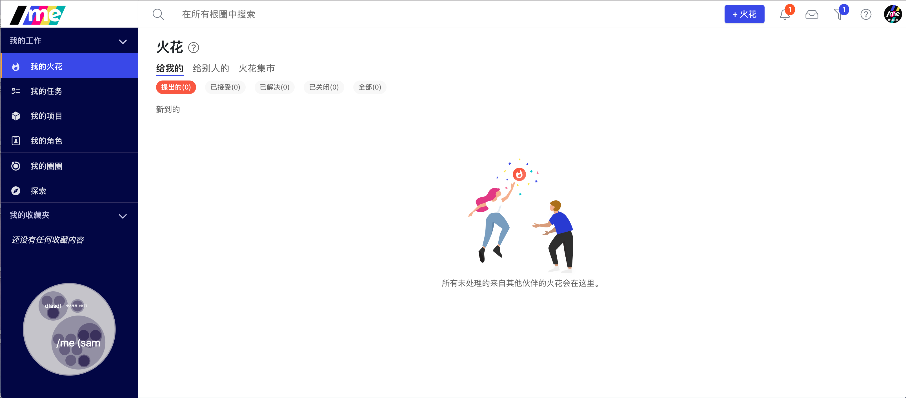

# 产品更新日志

## 网页端更新 - 2019-12-10

### 新功能

* 支持在一个项目下可以为其他角色创建火花来一同协作

在火花卡片上可以看到创建它的项目名称。

## 网页端更新 - 2019-12-05

### 新功能

* 通过会议产生的任务和项目上显示会议火花的链接。点击这个链接可以直接到相应的会议火花了解更多背景信息。 

### 优化

* 焕然一新的圈层图颜色

* 显示角色下承担者的名字

## 手机端更新 - v4.02.30 \(2019-12-05\)

### 优化

* 优化了圈层图的显示界面

### 修复的主要bugs

* 修复了用户登出后出现白屏的情况

## 手机端更新 - v4.02.16 \(2019-11-29\)

### 优化

* 优化了火花创建页面，把火花发起和接受者信息往上挪，并与电脑网页端设计一致

### 修复的主要bugs

* 修复了无法用邮件邀请新用户的错误
* 修复了无法保存任务里的描述的错误

## 手机端更新 - v4.02.13（2019-11-24）

### 新功能

* 支持分享一个张力到微信和其他第三方软件。

### 优化

* 新的更加清晰的用户邀请界面

### 修复的主要bugs

* 点击搜索结果无法直接到达该结果的详情页面。 

## 网页端更新 - 2019-11-19

### 优化

* 在由火花生成的任务和项目上显示对应的火花链接。

* 优化了火花卡片上的日期显示，总是显示火花更新的时间。最新更新的火花在最上面。
* 优化了从一个火花创建一个任务/项目的速度。
* 很多的整体界面的细节优化

### 修复的主要bugs

* 点击火花创建窗口外部会直接关闭整个火花，造成信息的丢失。 
* 新注册用户没有创建例子根圈。
* 新建的根圈下没有生成预设的圈圈协调员角色。 
* 无法上传文件。

## 网页端/手机端更新 - 2019-11-06

### 优化

* 添加了火花更新显示（小红点儿）

* 优化了火花的排序，最新更改的火花会出现在最上面方便大家查看
* 更容易找到帮助中心
  * 在左边侧边栏添加了帮助中心的入口
  * 右上角的❓下除了帮助中心，还可以找到产品更新日志，如何下载手机端和/me官网快速通道。

* 优化了圈层图上角色圈子名称的显示

### 修复的bugs

* 修复了关于手机端推送消息送达的问题
* 修改了多处文案错误
* 删除了忘记密码页面上不必要的按钮
* 恢复了保存个人页面后的消息通知

## 网页端/手机端更新 - 2019-10-31

### 新功能

* 在网页端支持[火花功能](wo-xie-gang-app/3.-wo-de-huo-hua.md)

* 在手机端根圈下支持显示根圈圈层图

### 优化

* 优化了左侧的侧边栏的结构和显示

* 优化了圈层图的显示

## 手机端更新 - v4.01.75 \(2019-10-28\)

### 优化

* 把个人头像挪到了底部导航栏，“探索“功能可以在“根圈“下找到。
* 更新了新的帮助中心链接

### 修复的bugs

* 修复了bugs

## 安卓手机端更新 - v4.01.60 \(2019-10-21\)

### 优化

* 优化了把一个伙伴添加到一个角色/任务/项目上的体验流程

### 修复的bugs

* 修复了点击“关于火花“的帮助页会导致app闪退的问题

## 手机端更新 - v4.01.50 \(2019-10-09\)

### 优化

* app系统运行整体优化
* 体验优化：在一个圈子里，可以更方便的创建新角色/子圈

## 手机端更新 - v4.01.30 \(2019-09-27）

### 修复的bugs

* 修复了多处bug

## 手机端更新 - v4.01.21 \(2019-09-25\)

### 优化

* 多处app系统运行速度的整体优化
* 体验优化：可以更方便的选择火花的接收者

### 修复的bugs

* 修复了多处bug

## 手机端更新 - v4.00.83 \(2019-09-17\)

### 优化

* 整体运行速度优化
* 优化了设置功能的位置
* 其他界面优化

### 修复的bugs

* 修复了多处bug

## 手机端更新 - v4.00.60 \(2019-09-03\)

### 优化

* 优化了截止日期的显示

### 修复的bugs

* 修复了苹果手机app更新后直接会去app下载页面的问题

## 手机端更新 - v4.00.53 \(2019-08-28\)

### 新功能

* 今日计划支持每日聚焦在最重要的事物上。
* 在“事儿”下支持分享一个任务/项目到微信

### 优化

* 添加了更多新用户导航帮助说明
* 优化了“事儿”下的筛选功能
* 优化了搜索功能结果的分类和快速检索

### 修复的bugs

* 修复了多处bug

## 手机端更新 - v4.00.08 \(2019-07-19\)

### 新功能

* 全新的手机端上线！

### 优化

* 多处用户体验优化

### 修复的bugs

* 修复了多处bug

## 网页端更新 - v2.3.14 \(2019-05-03\)

### 优化

* 在会议中防止多人共同编辑一个条目导致信息丢失
* 支持角色列表下对角色的手动排序
* 优化了根圈管理员属性的设置
* 优化了网页端的系统运行速度

### 修复的bugs

* 修复了多处界面显示的问题
* 修复了用户手册链接

## 网页端更新 - v2.3.13 \(2019-03-17\)

### 新功能

* 根圈管理员设置，添加了针对企业微信登录的用户进出管理设置。

### 优化

* 在一个会议结束8小时后自动关闭会议

## 网页端更新 - v2.3.11 \(2019-03-09\)

### 新功能

* 支持上传根圈图标
* 支持在根圈卡片上显示伙伴数，角色数和圈子数

### 修复的bugs

* 修复了多处bug

## 网页端更新 - v2.3.10 \(2019-02-15\)

### 新功能

* 支持企业微信登录

### 优化

* 优化了关于“今日计划“功能的使用体验
* 优化了多处产品文案
* 优化了上传附件的显示，特别是在有很多附件的时候
* 优化了“分配给我“按钮的使用逻辑
* 优化了系统初始化的速度

### 修复的bugs

* 修复了多处bug

## 网页端更新 - v2.3.08 \(2019-02-09\)

### 新功能

* 今日计划

### 优化

* 优化了“我的任务“页下，针对每个任务的面包屑的显示

### 修复的bugs

* 修复了多处bug

## 网页端更新 - v2.3.06（2019-02-02\)

### 新功能

* 我的任务页面下，可以通过角色/到期日/创建日期来排序
* 我的任务页面下，可以点击每个任务展开右侧边栏来快速编辑整个任务
* 在点击每个用户的头像和搜索一个用户结果后呈现一个该用户的个人使命

