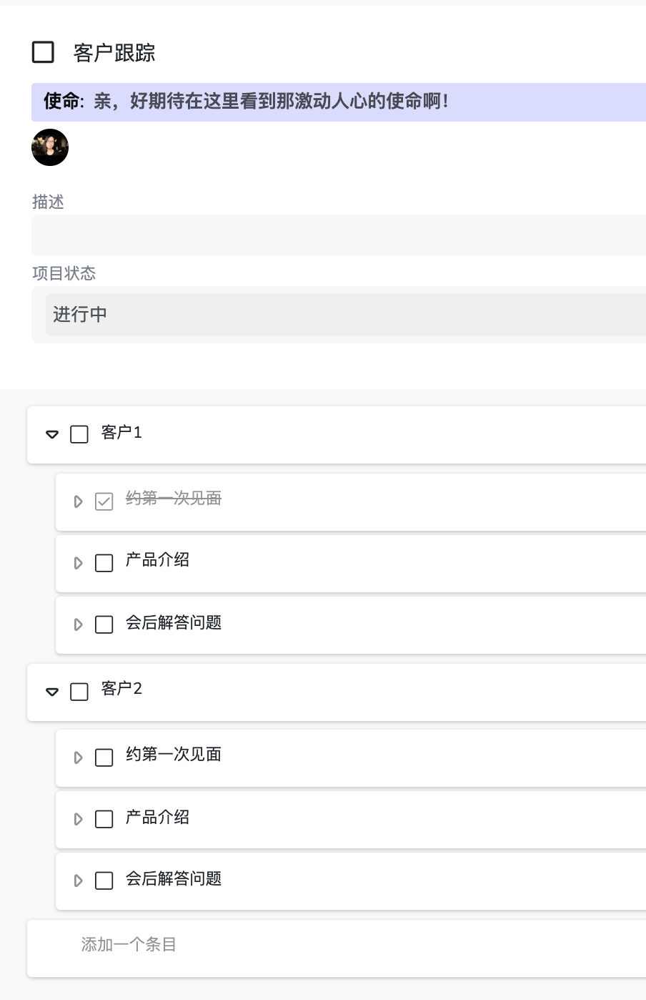
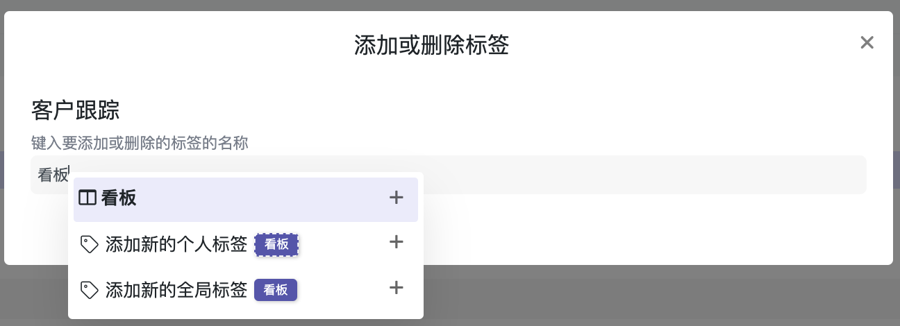
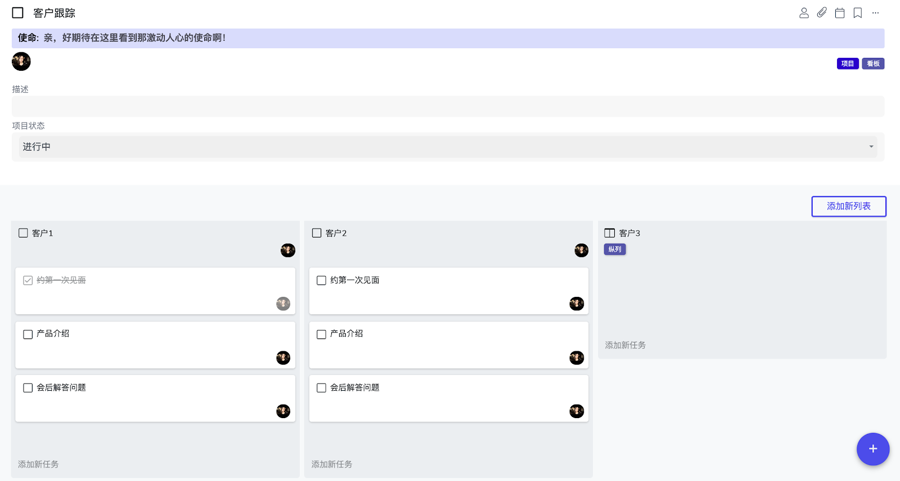
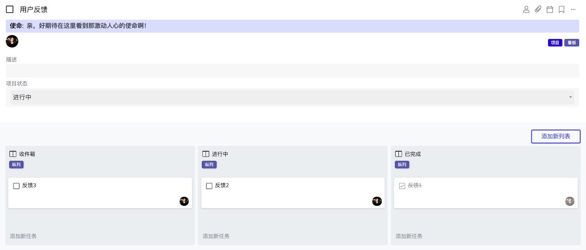

# 7.1 创建看板

系统内部提供一个看板标签。这个标签可以改变整个项目下的任务的表达方式。特别试用于需要一定流程的项目。比如销售流程，市场宣传流程， 生产流程。另一个很实用的应用就是跟踪项目下任务的进展情况。

比如在下面这个项目下，我们有一系列的子任务，子任务下还有任务。现在的显示是一个列表的方式。

点击“标签”按钮，输入“看板”点击最上面的看板标签。同一个列表按照最上级的子任务被分成了几列。可以用“添加新列表”来添加新的纵列，比如说 “客户3”。

对于一个大项目，也可以用看板来表达各个子任务的进展。

1. 在新项目下，点击“标签”加“看板”标签
2. 点击“添加新列表”来定义需要的纵列， 比如“收件箱”，“进行” 和“已完成”。
3. 设计好纵列后，可以在里面建任务来跟踪任务的进展。

