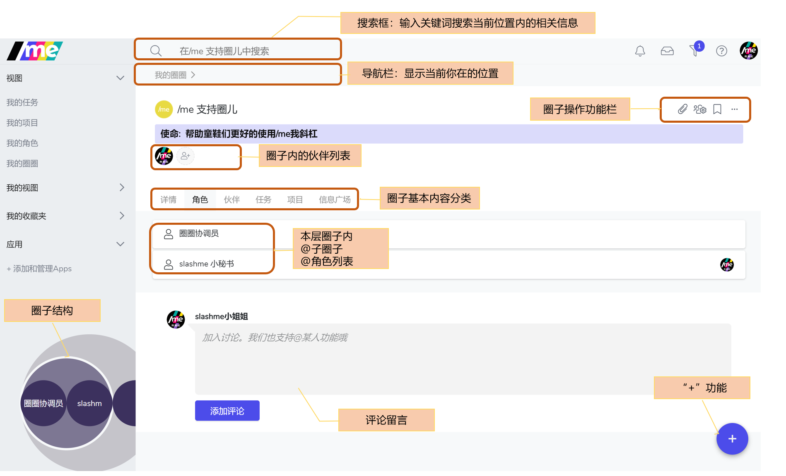

# 2.2 了解根圈（主页及界面）

进入到一个根圈后，大家会看到很多内容。下面会对每一个部分进行简单到说明。

* **圈子结构图：**
  * 左下角始终出现，帮助你快速通过视图了解组织结构，查找圈子或角色。
  * 也可以点击该视图右下角的“**箭头**” 放大或缩小视图
* **超级重要的 “+”功能：**
  * 右下角的“+”号按钮帮助你快速创建新圈子/新角色/新任务/新项目等。
* **搜索框**：输入关键词帮助你快速搜索到相关信息
  * 根据你当前所在的不同位置（导航栏提示），只能搜到该位置内的相关信息
  * 你可以输入各种关键词，/me 将帮助你分类搜索到角色/圈子/任务/项目/信息记录/用户等等。
* **导航栏：**现实你当前所在的位置。 你也可以点击之前的步骤，回到上级菜单。
* **圈子操作功能栏：**你可以添加附件/圈子设置/添加收藏，点击“...”可以看到更多功能
* **圈子内的伙伴列表：**显示该圈子内承担角色的伙伴。
* **圈基本内容分类：**点击不同的页面，查阅不同类型的信息 各页面详细定义和操作功能介绍请[参考这里](../shi-yong-shou-ce/)。 
* **评论留言：**支持圈子伙伴在一个空间，一个话题下的留言和交流。

