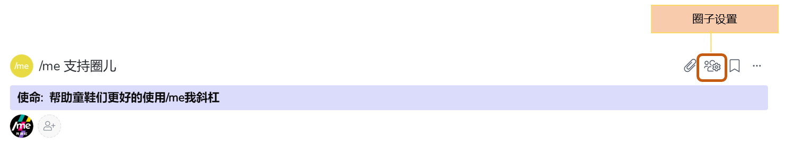
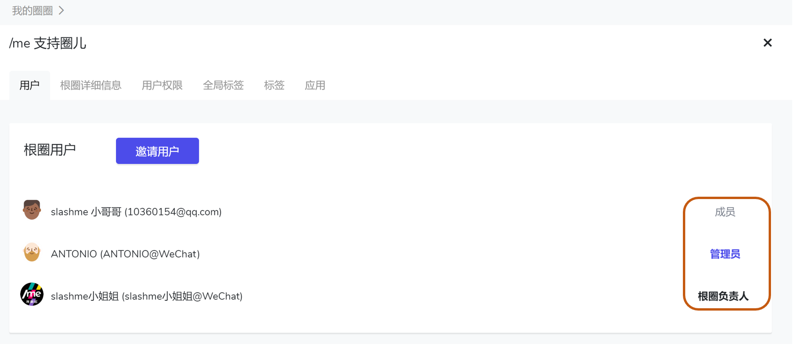
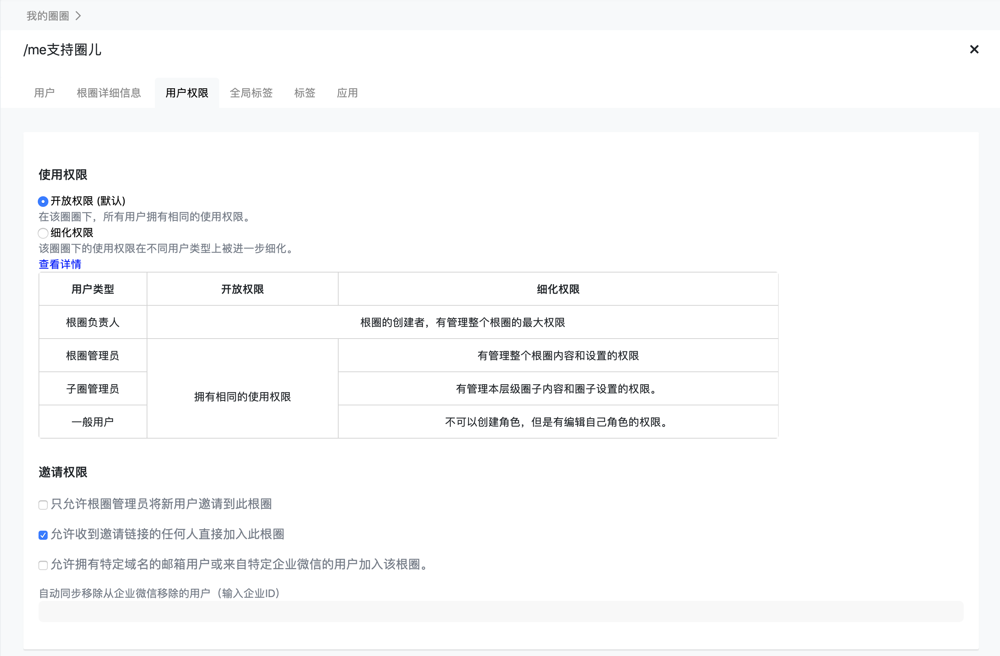

# 2.5 圈圈里的用户权限

### 管理权限

/me平台上，在一个根圈子下的用户，根据管理权限不同，分为4类：

**根圈负责人\(Workspace owner\)：**

* 一般是第一个创建组织根圈子的用户。
* 一个根圈需要有一个根圈负责人，默认第一个创建根圈的伙伴。
* 账户负责人拥有最大的权限。可以更改组织里的任何信息，包括邀请其他用户进入到组织。
* 只有账户负责人可以删除根圈子。
* 将来会有更多只有账户负责人可以使用的操作比如说产品付费功能。

**根圈管理员 \(workspace admin\)：**

* 可以更改根圈子内的任何信息，包括邀请其他用户进入到组织。
* 多人可以成为一个根圈子的管理员。

**圈子管理员 \(circle admin\)：**

* 只可以更改本圈子下的任何信息，包括建立子圈子/角色等。
* 圈圈协调员的承担者具有圈子管理员的权限。
* 只有在一个圈子里承担角色的伙伴可以承担这个圈子的管理员。
* 多人可以成为一个圈子的管理员。

**普通用户 \(user\):**

* 可以更改自己角色的信息。

### 如何查看管理权限？

第一步：圈子主页 -&gt; 圈子设置

第二步：点击“用户”便可以看到用户的当前权限设置


用鼠标滑动到右侧的伙伴权限可以进一步把某个伙伴设置成根圈管理员或者取消某一个伙伴的管理员角色。

目前不支持更改根圈负责人。如有需要，请联系help@slashme.com。


### 如何设置权限？

在根圈子主页下，点击根圈子设置按钮

点击“用户权限”可以根据你和团队的需要设置不同的权限模式。在这里可以设置**“使用权限”**及**“邀请权限”**。

