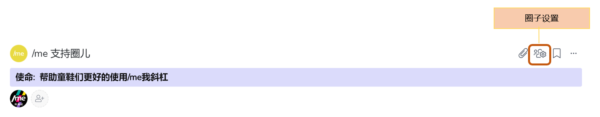

# 2.4 如何删除一个根圈？

在/me平台，一个根圈负责人有权限删除整个根圈。 查看这里了解如何判断谁是根圈负责人（链接到用户权限那页）

一、在根圈子主页点击**“圈子设置”**​

二、进入设置页面后，点击“根圈子详细信息”。 在最下面有删除根圈按钮。


* 根圈子一旦删除，所有信息也将全部同步被删除
* 如需提前下载圈子内相关信息或者想吃后悔药，请联系/me 客服小姐姐：wechat: iloveslashme 或者 help@slashme.com


