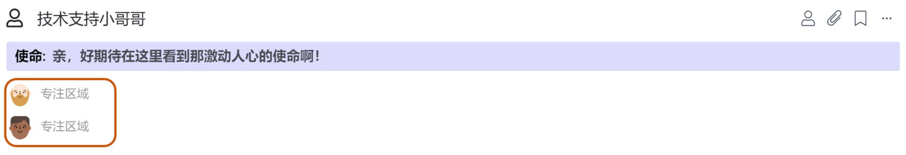
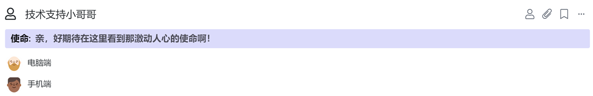

# 3.4 多人承担同一角色

**/me 我斜杠 系统支持多位伙伴承担一个角色**​。

当多余一位伙伴承担同一个角色时，建议为各自设置**”专注领域"**：指伙伴在承担同一个角色时所工作的侧重点的不同。

例如：

角色@销售，A同学的专注区域是-华东区，B同学的专注区域是-华北区；

角色@招聘官，A同学的专注区域是-后端岗位，B同学的专注区域是-前端岗位；

角色@客户服务，A同学的专注区域是-早班，B同学的专注区域是-中班。

💡让我们来看看@技术支持小哥哥 是怎么分配**"专注区域"**的吧。

### 知识小贴士[📝](https://emojipedia.org/memo/)

> **什么情况下可以一个角色由多人承担?**

> 1. 当伙伴们的工作拥有高度一致的共同使命时
> 2. 当伙伴们承担共同的工作目标（例如OKR\)，为结果的达成共同负责时
> 3. 当伙伴们的工作内容，工作责任高度一致时
>
> **什么情况下又最好设置成不同的角色呢？**
>
> 1. 当大家的工作内容和责任有明显区分时
> 2. 当过多同学（一般不超过6位）承担一个角色时，则建议成立圈子
>
> **常见症状**
>
> 1. 有些团队将角色的责任进行拆分，邀请多位伙伴承担。你负责1、2、3条责任，我负责4、5、6条责任，这样的情况实际上应该是两个角色；
> 2. 过多的伙伴承担一个角色（超过6位），则当这个角色和其他角色进行协同或沟通时，就会时常造成混乱。

