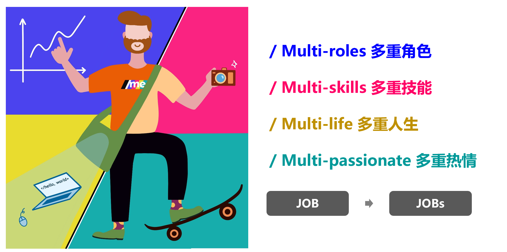
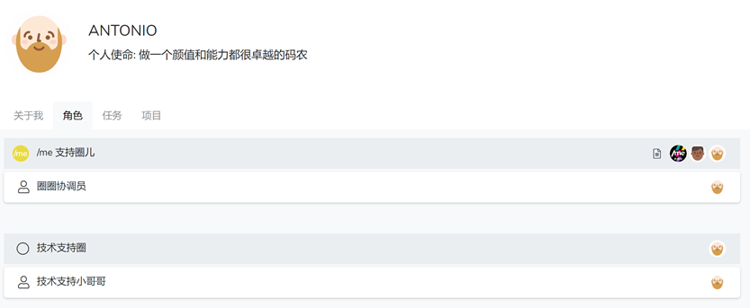
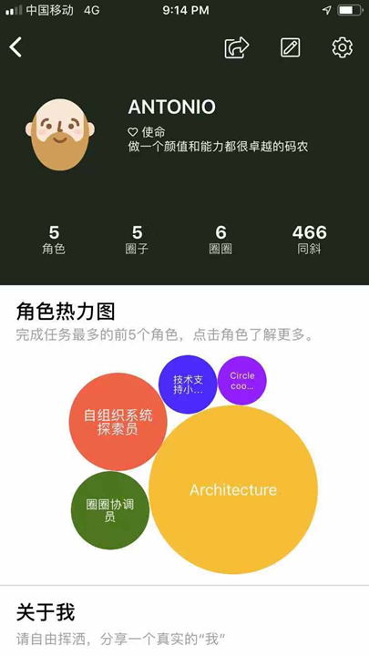

# 3.5 一人承担多个角色

**/me 我斜杠 全面支持你 ”斜杠青年“的工作模式，你不仅可以同时为多个团队/组织（根圈子）工作，同时也可以在一个团队/组织（根圈子）内承担多个角色。**​

### 查看伙伴承担的角色

如果想要查看其他伙伴承担哪些角色， 可以直接在搜索框里输入伙伴的用户名或者在你能看到有这位伙伴头像的任何界面，鼠标点中伙伴头像logo, 点击**“查看个人页面”。**

**APP手机端更精彩，更好玩儿呦~**

