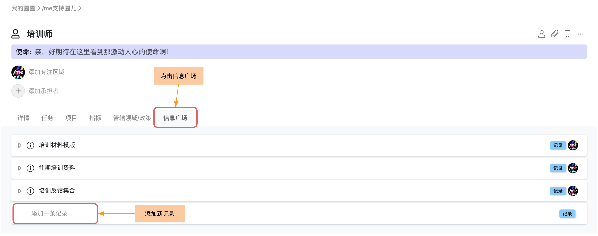

# 4.5 信息广场

相信大家在工作中会积累很多的跟自己承担的角色紧密相关的知识，比如说一些经常会用到的资料，流程介绍，小贴士等等。如果这些信息可以随时的在手边，不单单可以很好的提高自己的效率，其他同事以及未来需要把一些工作交付给其他小伙伴的时候，都会非常的方便。

所以，我们在/me里为每个圈子和角色都设计了一个叫做“信息广场”的广阔空间，大家可以把这些平时散落在手机里，台式机里，笔记本上，便利贴里的好内容统统放在这里啦。多么让人神清气爽的一个功能啊！

### **添加一条记录**

非常简单！在自己的角色或者圈子下，找到“信息广场”页面， 就可以了！比如下面，在我的一个叫做“培训师”的角色下，我可以添加跟我这个角色密切相关的一些信息。


1. 任何对某个角色或者圈子有价值的信息都可以作为一条记录放在“信息广场”下。推荐大家尽量有一个比较清晰的结构来帮助自己和他人找到需要的信息。
2. 在每一条记录下， 大家都可以尽量的使用“描述”区域来记录文字性的内容好方便彼此快速的查看。


好啦！期待看到大家把各自的角色搭建的更加丰满啊！

