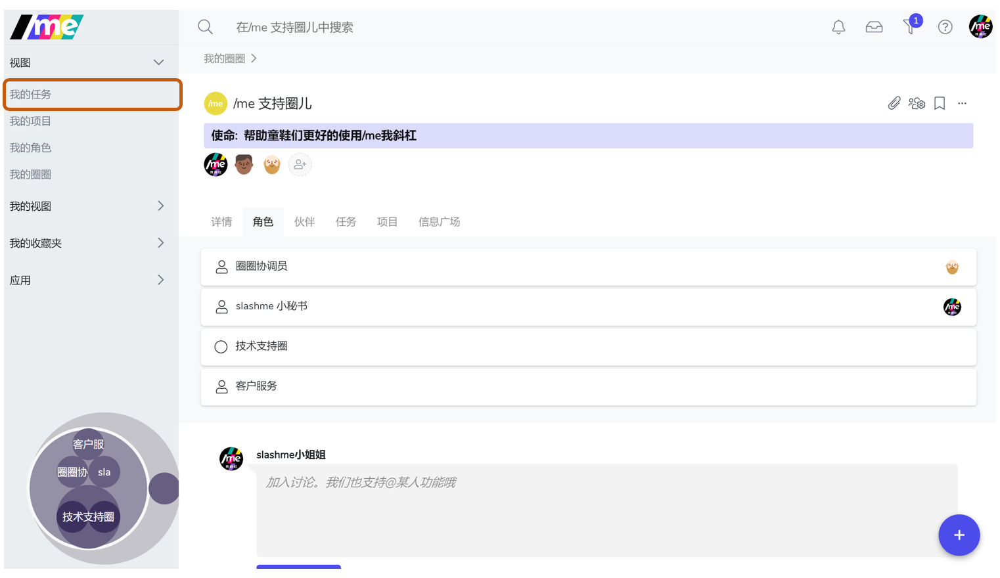
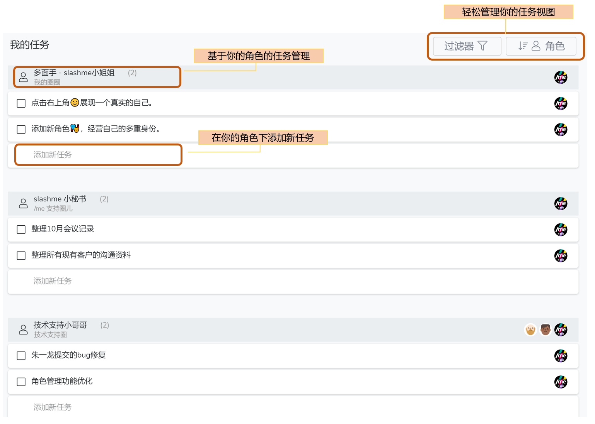
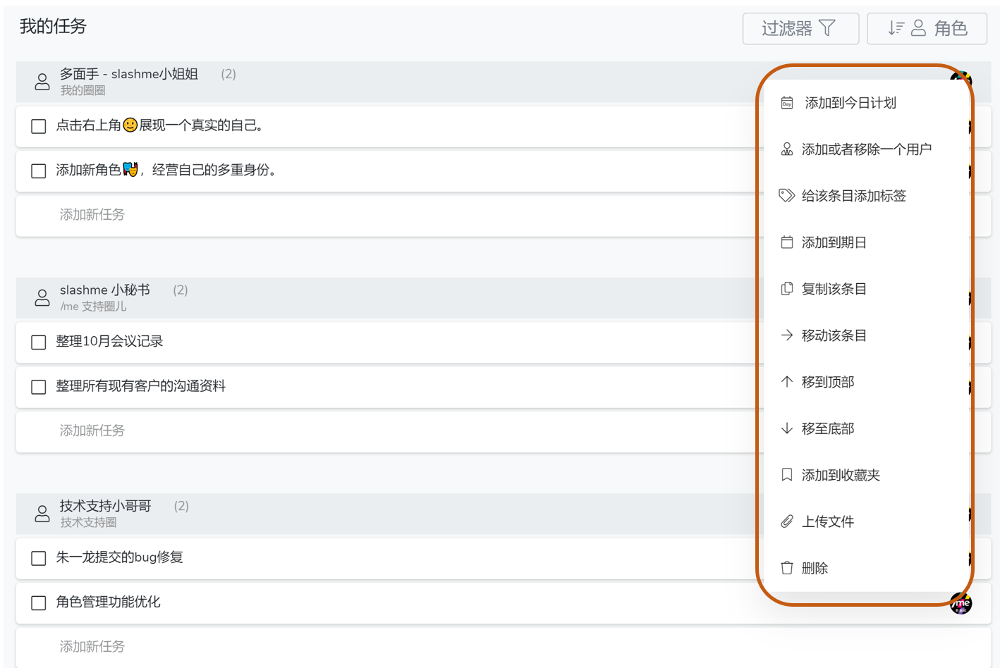
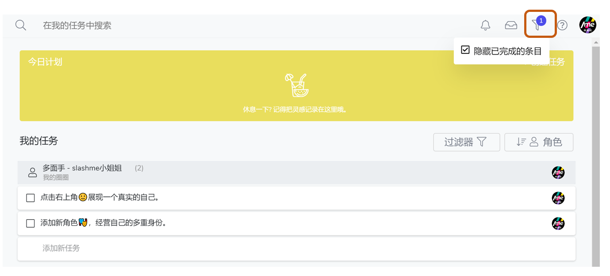
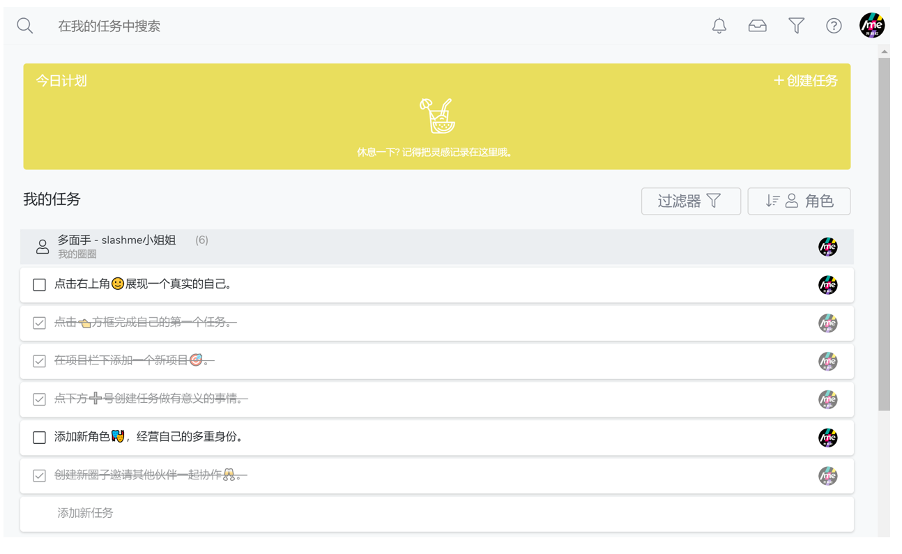
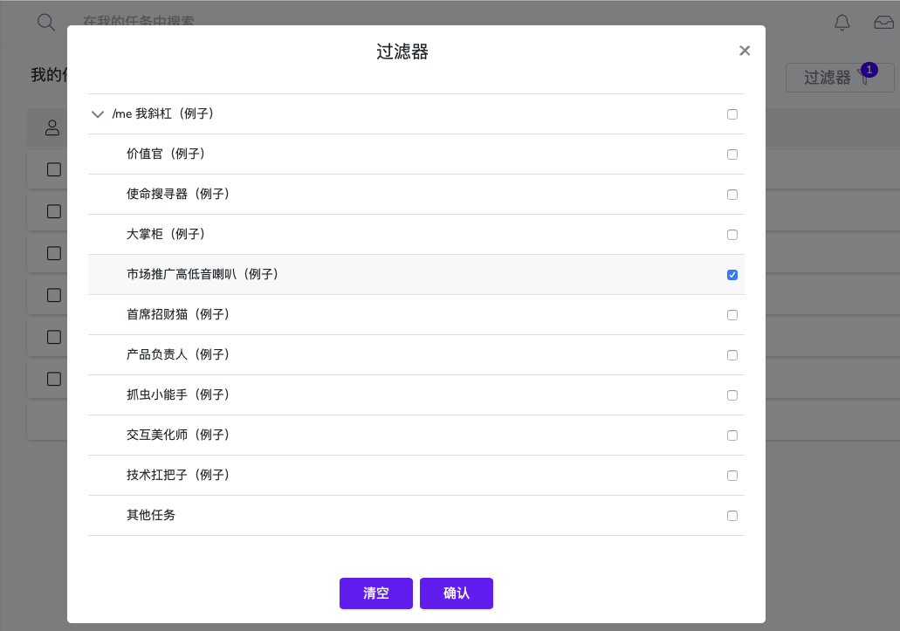
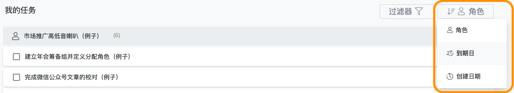

# 4.2 任务管理

/me平台支持新的自组织的工作方式，每个伙伴可以根据自己角色的定义来安排自己的工作。 工作内容是通过在不同角色下创建任务/项目来完成的。

本篇我们介绍任务的使用方法。

### 进入“我的任务”

你可以在任何场景下，通过左边栏快速进入“我的任务：

### 我的任务界面

基于我承担角色的任务管理

### 更多添加任务的方式

* 你可以在任何时候点击右下角"+"按钮,添加任务
* 你可以在任何角色的主页，点击“任务”栏，查看当前的任务，或添加新任务

### 更多关于任务的操作

点击目标任务条目右侧三个点icon, 你可以进行更多关于该任务的操作

### 查阅已完成任务

第一步：点击/me页面整体右上角“过滤器”功能键，取消勾选“隐藏已完成的条目”

第二步：即可以看到所有你已经完成并勾选的历史任务

### 过滤器

可以让我关注在那些当前重要的角色的任务上。

当大家有更多的角色后，任务会变得很分散，随处可见。同时在某个时期，可能你只关注于某几个角色。大家的注意力好宝贵，需要一个“过滤器”来支持一下。现在你可以通过它来选择哪些角色下的任务是你想看到的。


“其他任务”指的是你在其他角色下的任务或者是承担的个人行动


### 任务排序

我们现在支持按照角色/到期日/创建日期来为我的所有任务排序。 未来会支持更多选项。


如果当天有重要的deadline, 可以直接在“今天”直接添加新任务。


