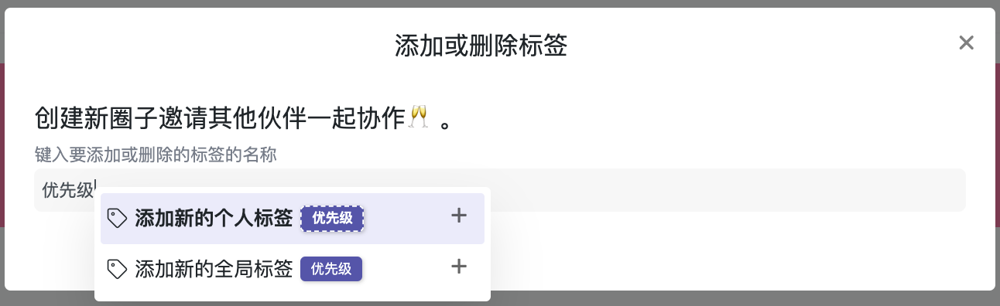
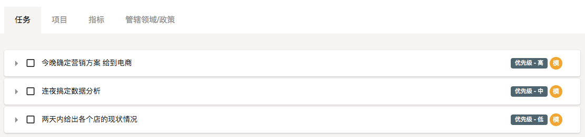

# 8.2 标签系统

在/me系统里，每个任务和项目下都可以添加不同的标签来进一步描述该条目的一些特质，比如说条目的优先级。

### 添加标签

1. 找到一个任务或者项目，点击右上方的三个点点按钮，在下拉菜单里找到标签按钮。

&#x20;  2\. 在弹出框里，填写标签名称 （[📌](https://emojipedia.org/pushpin/)标签至少需要两个字节）。

标签可以分为两类，个人标签和全局标签。

* 个人标签：只有自己可以看到和使用。
* 全局标签：一个根圈里的其他人都可以看到和使用该标签。比较适合一些预先定义好的，大家都认同的标签。


_移除一个标签，可以点击同一个标签按钮或者在条目里双击该标签即可。_


### ​
