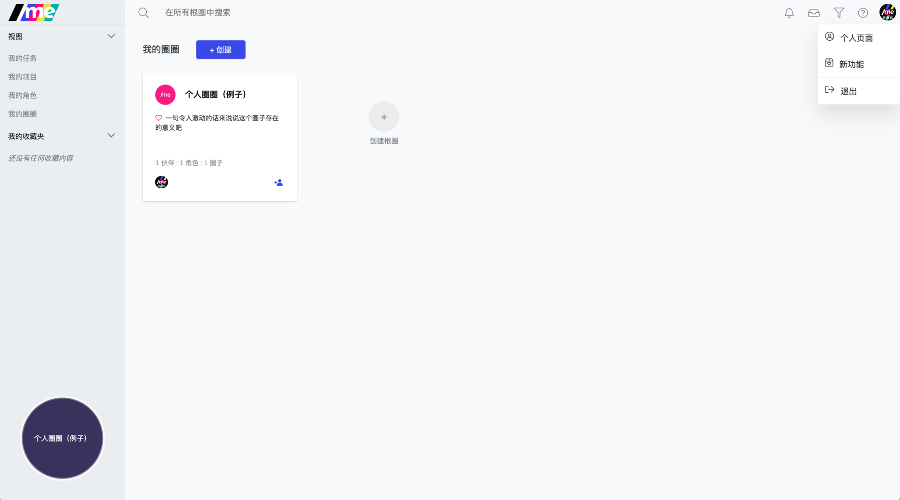
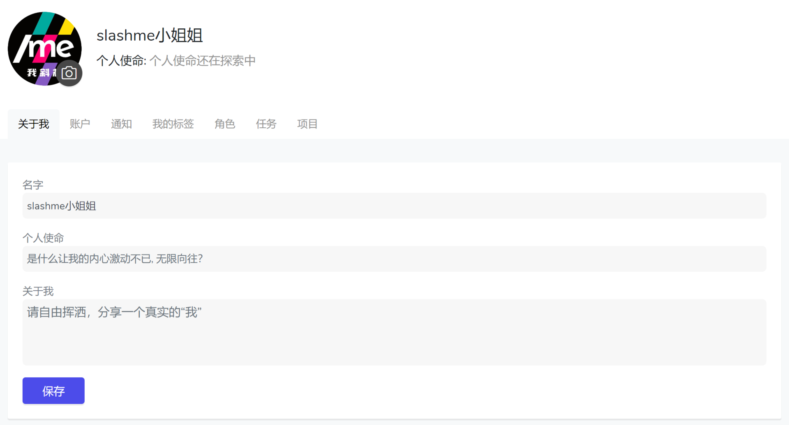

# 5. 个人主页

希望可以让其他的伙伴尽快找到自己？请移步个人设置页面。

在/me主界面，点击右上角的“**头像**”，下拉菜单里选择“**个人页面**”。

在打开的"个人页面“上会有几个围绕你的设置页面。

* 在“**关于我**”页面下， 你可以：
  * 换个新头像
  * 填写个人使命
  * 填写更多其他你想让其他伙伴知道的事情
* 在“**账户**”页面下，你可以：
  * 关联更多的邮箱
  * 更改邮箱注册的密码
  * 关联第三方登录方式：微信/企业微信
  * 设置系统语言：中文/英文/荷兰语

点击链接了解个人页面中的其他设置操作。

