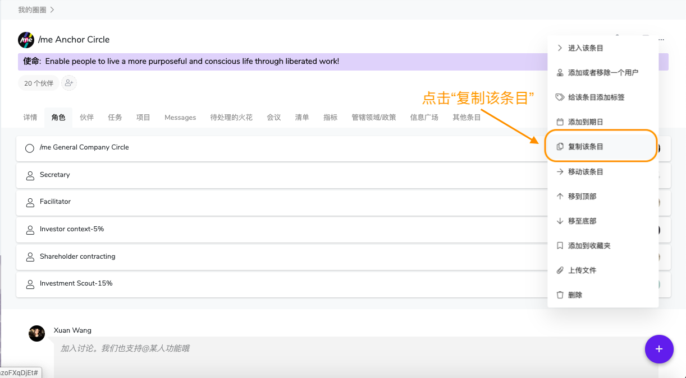

# 2.6 复制角色或圈子

有的时候会出现在不同的圈子下的角色描述类似的情况。这个时候可以使用“复制“功能。

第一步： 在角色列表下，点击需要复制的角色/子圈右侧的“更多”（三个点）按钮。

第二步：在出现的控制列表上，找到“复制该条目”。

复制后的新角色会出现在要复制的角色下。你可以进一步编辑这个角色。 或者，从这里，可以使用[**“移动”功能**](ru-he-yi-dong-jiao-se-huo-quan-zi.md)来把这个角色挪到需要的圈子下。

