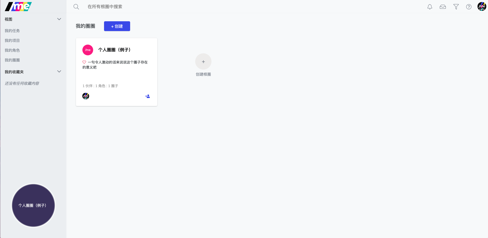
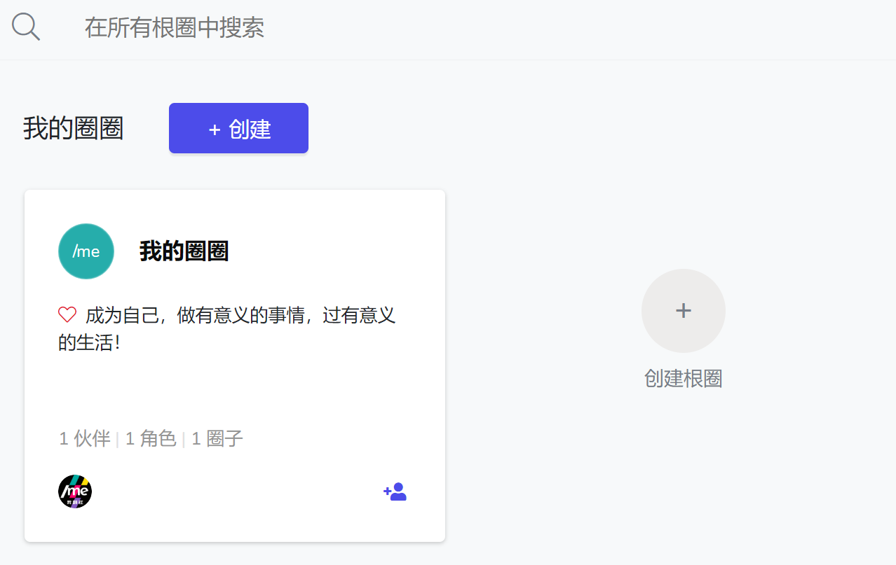
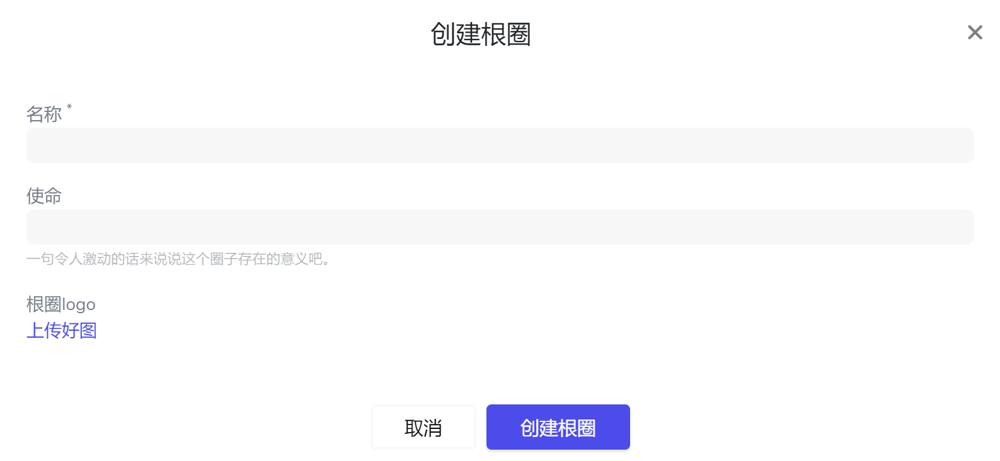
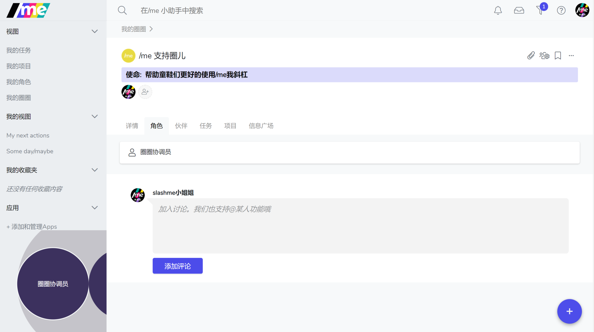

# 2.1 创建新根圈

一个根圈就像是一个群，大家以不同的角色一起搞事情。​

一、点击左上角“/me”logo 或 左边栏 “我的圈圈” 回到你的个人首页。

二、点击“**创建根圈**”

三、在弹框里，你可以直接设置“**根圈名称**”**，“根圈使命”**，以及 **“上传Logo"**

输入好后，点击“创建根圈”。圈子就建好啦。之后会自动进入根圈页面。

圈子初始化，即可拥有一个角色——“**圈圈协调员”**。 你也可以试着鼠标滑动到该角色点击并修改这个角色，试试吧。


**圈圈协调员角色是系统创建角色，可以修改但不可以删除。**


### 知识小贴士 📝

> **什么是根圈？**
>
> **一个拥有共同使命及目标的团队的总称。它是由个人所代表的不同的角色所组成的且高度协作的团队。圈子会因治理火花而随时发生定义或结构上的迭代，以确保其“弹性动态组织”的特性。**
>
> * 一般来说，一个根圈子往往是一家公司/一个社群/一个有边界的组织；
> * 圈子的设计是/me组织架构的基本逻辑，也是全面支持“自主管理“的架构设计；
> * 一个根圈子内的所有信息对成员保持充分的开放透明，这也是/me 支持的“自主管理”组织的核心基本原则；
> * 根圈内包含圈子和角色，每个团队可以根据自己团队的需求自行设计；
> * 当一位伙伴同时加入多个“根圈子”，则“斜杠青年”的平台化工作模式就此生成，即一位伙伴不再只为一家公司或一个组织所工作；
>
> **什么是使命？**
>
> **使命是圈子和角色的标识或意图，它明确了组织前行的方向。应是圈子或角色一切行动的出发点，是一种需要达成或行使的能力，潜力或者是一个尚未实现的长远目标。组织伙伴被邀请去聆听与理解组织想成为什么以及想要服务于怎样的宗旨。**

