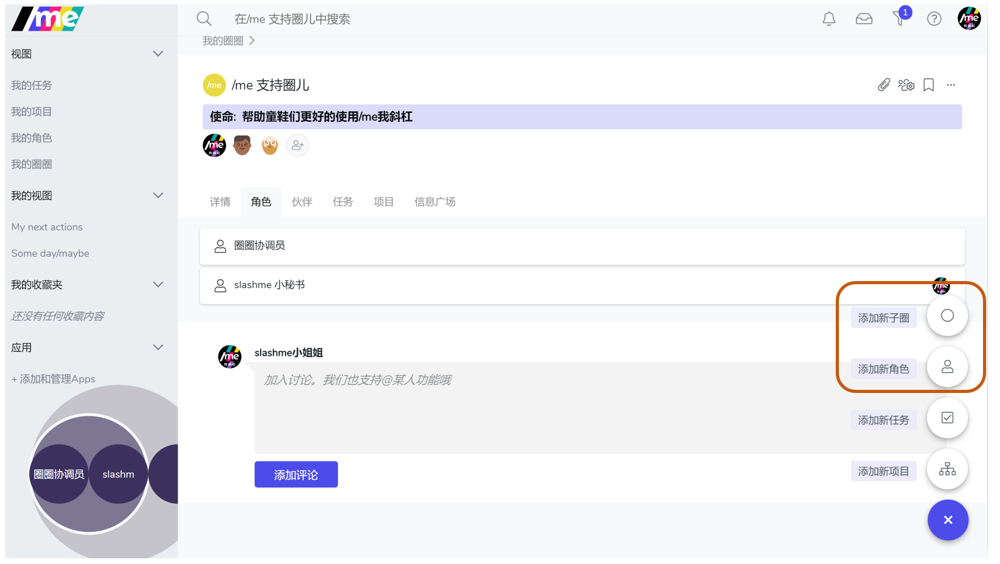
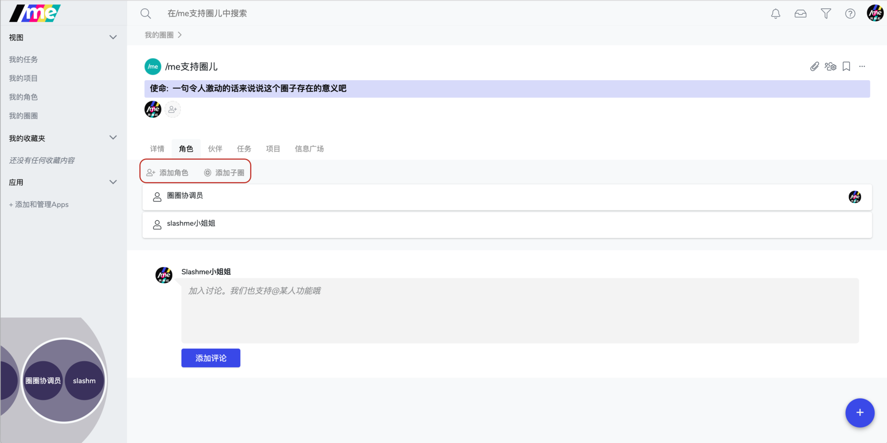
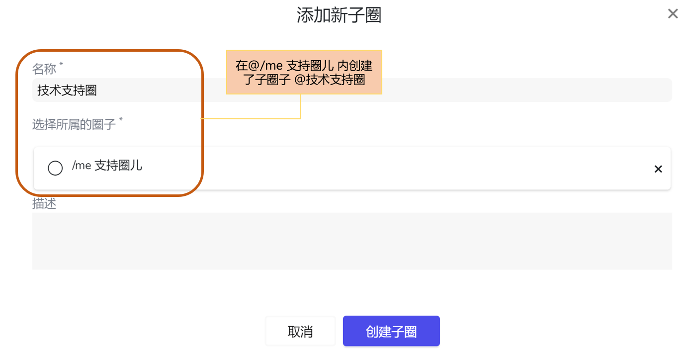
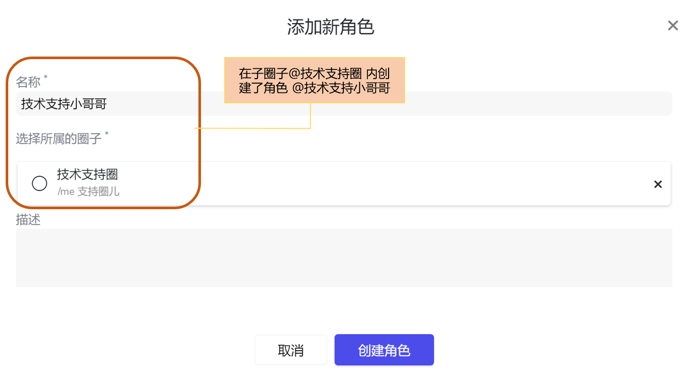
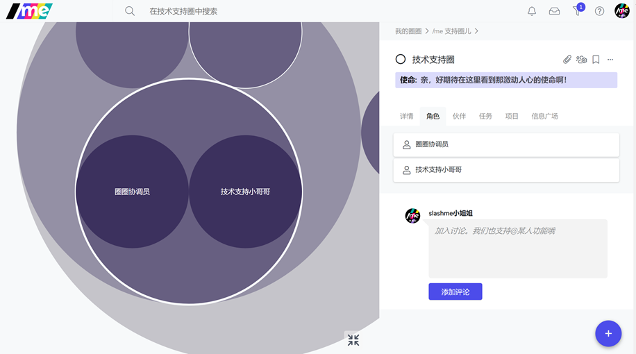

# 2.4 添加新角色或子级圈子

欢迎来到全新的团队协同模式和组织架构：圈子与角色

若想了解更多关于“圈子&角色”的设计逻辑，运行方式，和有趣的实践案例，见[资源下载](../../zi-yuan-xia-zai.md)。

### 如何添加圈子/角色？

第一步：有两种方式添加子圈/角色

[☝](https://emojipedia.org/white-up-pointing-index/)进入你想要添加圈子/角色的圈子，点击右下加”+” 按钮，选择添加子圈子或角色

[✌](https://emojipedia.org/victory-hand/)或者，直接在角色页面下添加

第二步：填写基本信息

**添加成功后，你可以即刻看到组织架构的变化**

这也正是/me 我斜杠支持**敏捷动态开放组织模式**的重要功能~

