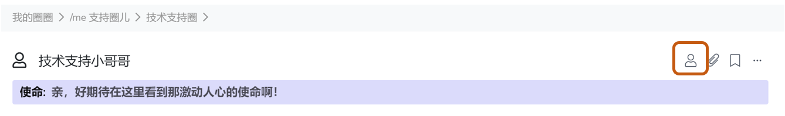
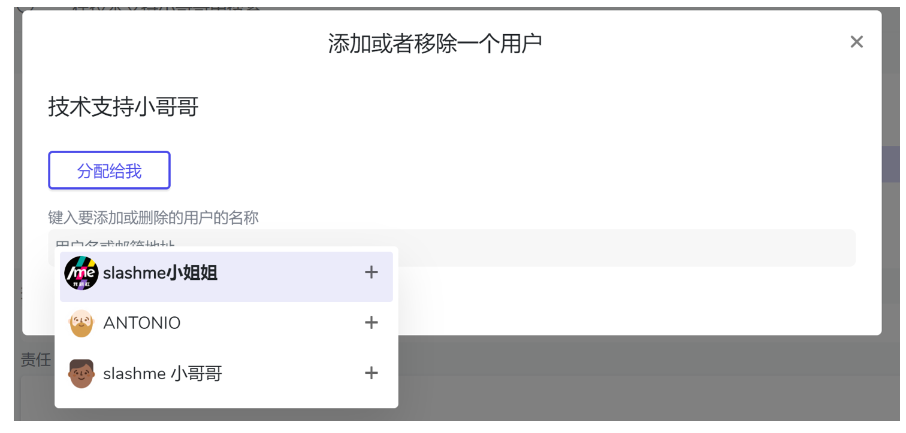
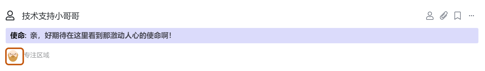
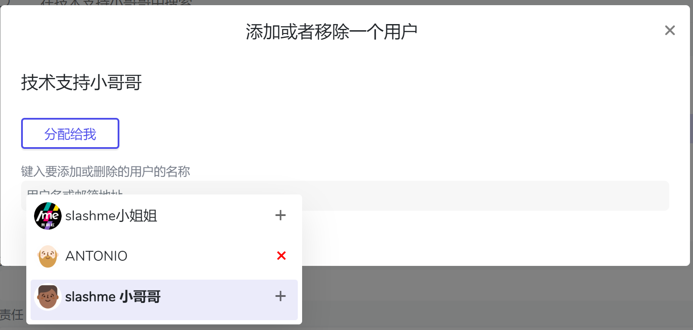
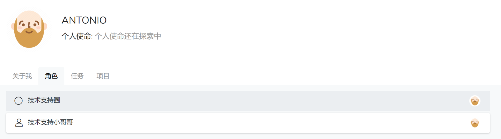

# 2.5 邀请伙伴承担角色

在/me平台上，每位伙伴会在一个或多个根圈下通过承担不同的角色来开展协作。

### 添加伙伴到角色

第一步：进入相应角色页面，点击右侧功能栏- ”角色管理” 按钮。​

第二步：在出现的对话框，你可以直接将该角色分配给自己，或者输入其他伙伴的用户名称进行添加。


目前一个伙伴需要已经在一个根圈下才能被加到一个角色上。如果无法找到一个伙伴，请确认这个伙伴已经在整个根圈下了。 


第三步：伙伴的显示。


在一个子圈的上层圈子给这个子圈添加伙伴的时候，这个伙伴会被直接添加到子圈的圈圈管理员角色上。一个子圈的圈圈管理员的承担者会代替这个子圈参与到上层圈子的运营中。


### 从角色上移除一个伙伴

第一步：进入相应角色页面，点击右侧功能栏- ”角色管理” 按钮。

第二步：在弹出的对话框里用用户名查找需要移除的伙伴。找到后， 在相应的伙伴名旁点击右侧“X"移除在该角色上的伙伴。

### 查看伙伴的角色信息

鼠标划到伙伴的头像logo上，点击**“查看个人页面”**


只有当伙伴添加到圈子内的某个角色，则才会在圈子主页显示伙伴


### 知识小贴士[📝](https://emojipedia.org/memo/)

> 原则上，/me 我斜杠 不支持加入一个圈子，但不承担角色的模式。也就是说，不能添加一位伙伴到圈子，但不承担任何的角色

