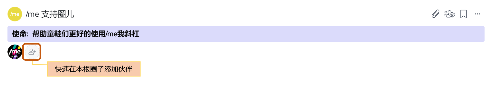
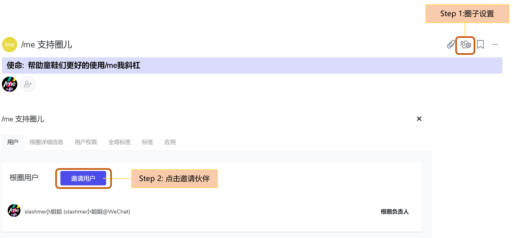
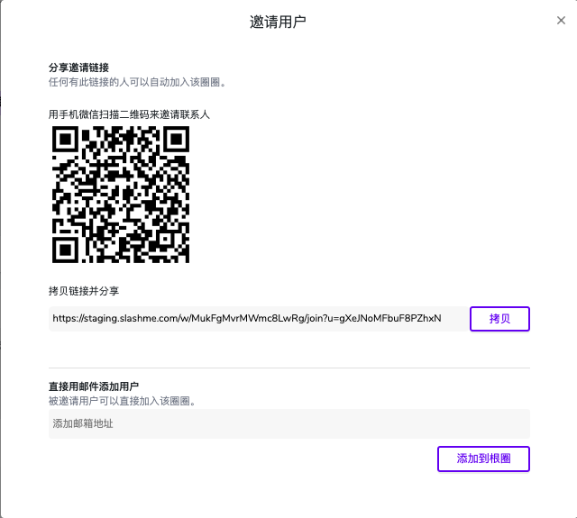
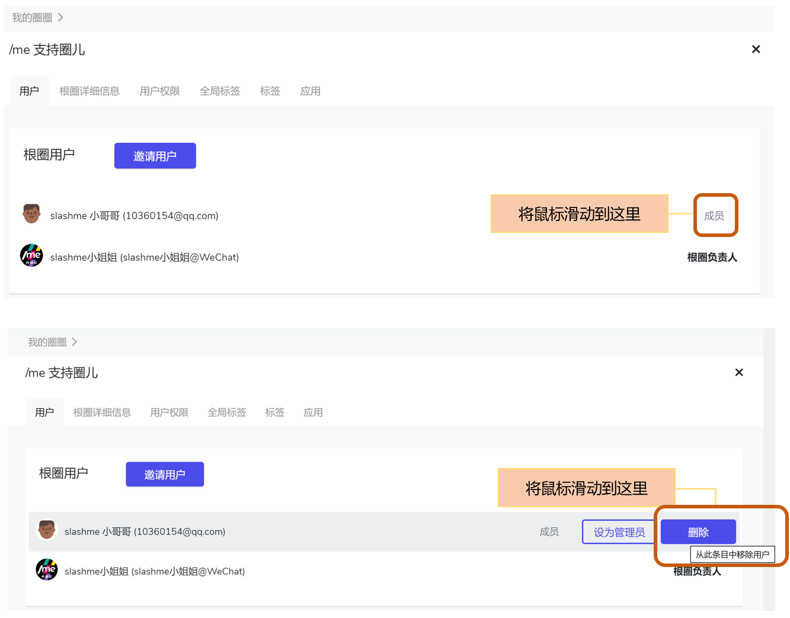
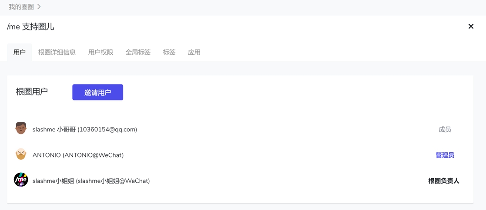

# 2.3 邀请伙伴加入

根圈子建好后， 就可以把伙伴们召集起来啦。

**有三种路径邀请伙伴加入根圈子**​：

一：在根圈子卡片上点击小人按钮添加

二： 直接在根圈子主页伙伴显示页面，点击“**添加伙伴**" 按钮

三：点击根圈子主页右上角 “圈子设置” 功能键，进入圈子设置页面，点击“**邀请用户**”

### 如何邀请？

点击“邀请用户”后，会出现一个弹窗。目前/me支持三种邀请方式：

* 微信扫描二维码后，把邀请链接直接分享到微信群里。
* 复制邀请链接后通过其他方式发给受邀请人，比如邮件，其他沟通工具等。
* 直接添加受邀请人的邮箱地址。


关于邀请用户的权限相关问题，请参考章节：[圈子的权限管理](../shi-yong-shou-ce/quan-zi-li-de-yong-hu-quan-xian.md)


### 如何移除伙伴？


你需要是根圈或者该圈子管理员，才能将一个伙伴从该圈子中移除


点击圈子主页右上角 **“圈子设置”** 功能键，进入圈子设置页面-用户


用同样的方式可以把某个伙伴设为根圈管理员或者取消Ta的管理员权限。


### 管理及查看根圈子的伙伴

点击圈子主页右上角 **“圈子设置”** 功能键，进入圈子设置页面-用户

