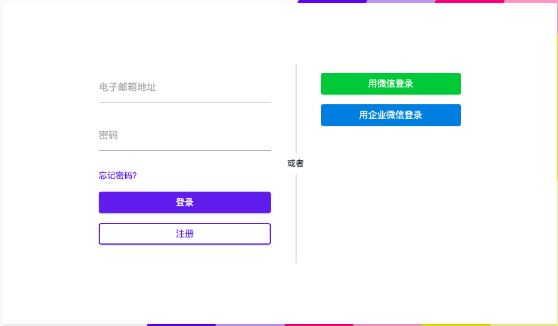
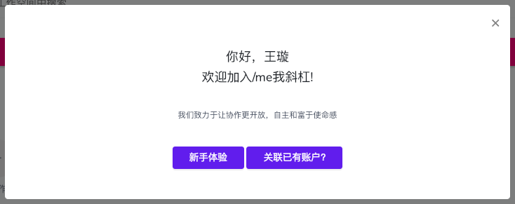
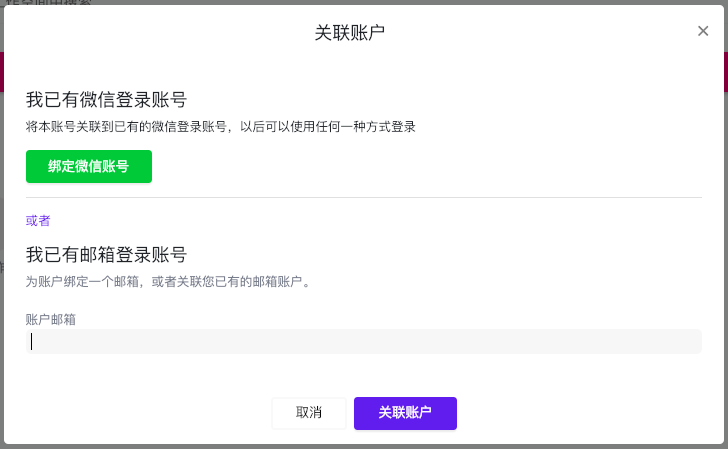
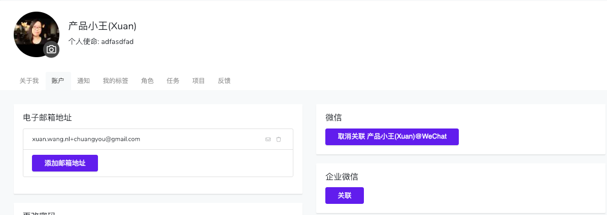

# 1.2 微信/企业微信第三方登录

/me目前支持除邮箱登录之外的微信和企业微信两种第三方登录方式。 

用户可以用微信或者企业微信直接注册账户开始使用/me。 具体支持的登录方式有： 

#### **1. 微信**

* 电脑网页端扫描二维码
* /me手机App端和微信内一键登录

#### **2.  企业微信**

> **注意：**企业微信除了在/me网页端可以直接扫码登录之外，其它情况下必须由你所在企业的企业微信管理员先对/Me应用进行授权安装后才能正常工作，请你的企业微信管理员访问这个链接进行授权吧：[https://app.slashme.com/wxworkinstall](https://app.slashme.com/wxworkinstall)

* 电脑网页端扫描二维码
* 企业微信内打开/me第三方应用来一键登录
* 由于企业微信未开放相关功能，目前/me手机App端不支持企业微信登录。 _小贴士：为了登录/me手机App，仅使用企业微信登录过的网页版的用户可以在网页版的个人设置账号页面内增加微信或邮箱绑定，便于在/me手机App登录_ 

下面我们以企业微信为例来介绍一下具体的使用过程

#### 1. 登录

#### 2. **和现有账户关联**

如果你已经有了一个账户，用企业微信扫描登录后，可以选择与现有的账户进行关联。关联成功后可以直接用任一账户进行登录。

另外一种关联方式是可以先用现有账户登录。然后在个人界面下的“账户”项下关联“企业微信”

可以随时取消关联好的第三方账户。不过在没有邮箱账户的时候，至少要关联到一个第三方账户。

