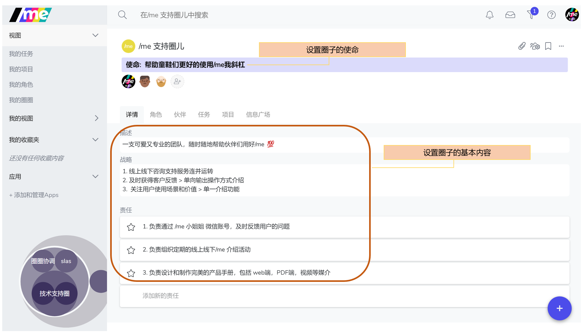
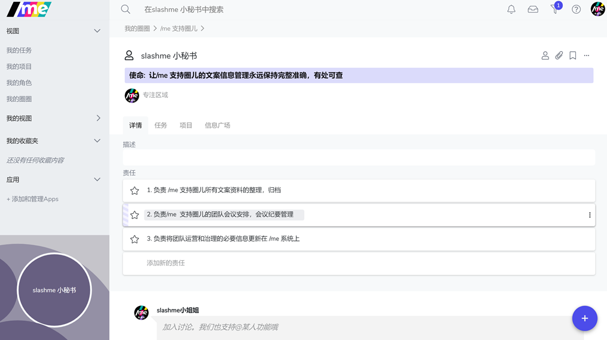
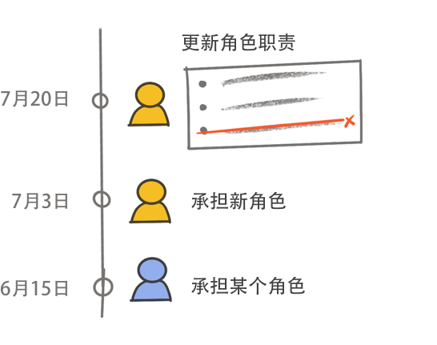
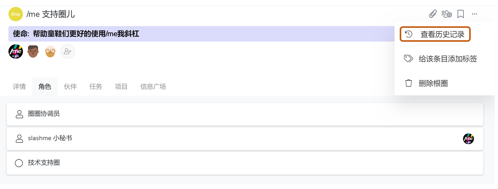
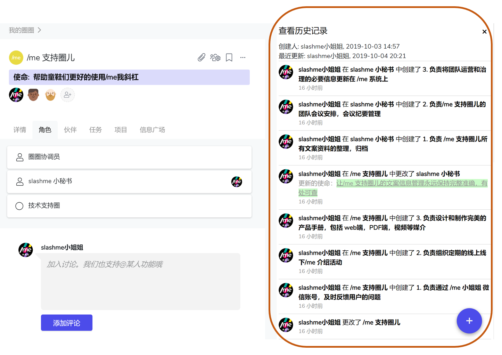

# 3.2 角色/子圈的设置与迭代

### 圈子基本信息设置

“**圈子主页**”点击“**详情**" 进行设置

开放透明，明确的治理信息是/me我斜杠所支持的团队和组织的必备原则。

来为你的圈圈创建激动人心的”使命“，和明确指导行为的”责任“吧！

### 角色基本信息设置

“**圈子主页**”点击“**角色**”，然后点击“**详情**" 进行设置

让团队知道这个角色的意义和价值（使命），以及负责什么（责任），帮助大家更好的合作！

来为你承担的角色创建激动人心的”使命“，和明确指导行为的”责任“吧！

### 圈子/角色的迭代

#### **迭代使命，战略，描述，和责任**

* &#x20;鼠标轻划到相应框框即可修改
* 使命，战略，描述，责任是圈子的初始化设置，不得删除
* 使命，描述，责任是角色的初始化设置，不得删除
* 责任对于圈子或角色至少拥有一条
* 删除多余的责任，则点击相应条目右侧三个点，选中”删除“即可 或者直接把责任的内容删除就可以了。

### 查看历史记录

本着开放透明的原则，在/me平台上会保留所有操作的历史记录。 你可以在任何圈子或者角色的主页，点击 功能栏部分的**三个点按钮** **“...”** 然后点击**“查看历史记录”。**

### 知识小贴士[📝](https://emojipedia.org/memo/)

> **使命 （Purpose)**
>
> 使命是圈子和角色的标识或意图，它明确了组织前行的方向。应是圈子或角色一切行动的出发点，是一种需要达成或行使的能力，潜力或者是一个尚未实现的长远目标。组织伙伴被邀请去聆听与理解组织想成为什么以及想要服务于怎样的宗旨。
>
> **战略 (Strategy)**
>
> 组织和圈子为使命而在一定时期内从全局考虑谋划实现阶段性目标的路径。
>
> 通常包含一段时间点圈子工作的重点，优先级，做什么和不做什么，达成目标的标志等。
>
> **责任 (Accountability)**
>
> 责任是圈子期望一个角色需要持续进行的一系列行动。角色对其被组织赋予的责任拥有自主决策的权利，同时需要主动承担并执行。责任与所对应圈子或角色的使命需高度吻合，且可通过治理角色动态迭代更新。
