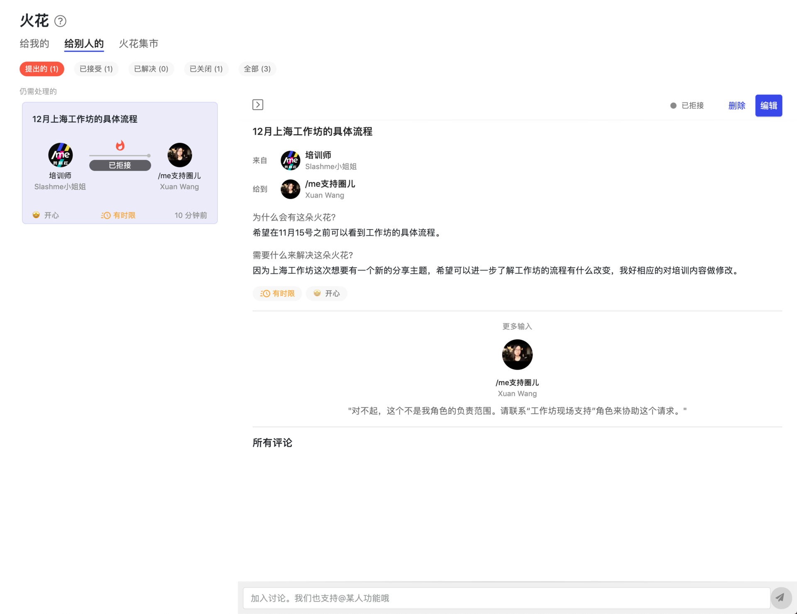
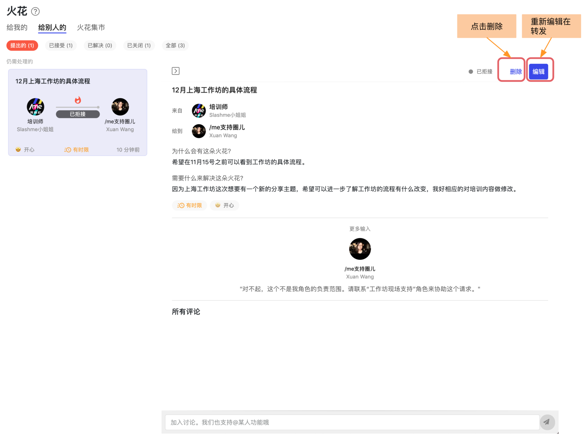
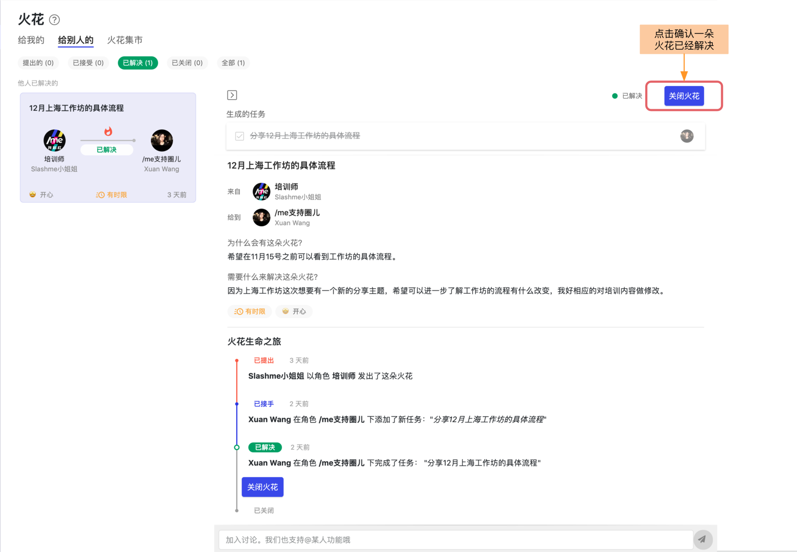

# 4.1 火花协作

**火花**是帮助大家自发自主的一起推动把事儿办成的重要沟通协作工具。在[**这一篇**](../../wo-xie-gang-app/3.-zi-zhu-xie-zuo-yu-ren-wu-guan-li/3.-wo-de-huo-hua.md)里我们专门介绍了什么是火花以及它的使用场景。

本篇我们来介绍在桌面端如何使用火花功能。&#x20;

### 火花的整体界面

下图显示了火花功能的整体结构。


**火花集市**里会显示所有我所在的根圈下创建的火花。通过了解这些火花，你可以知道其他的伙伴在忙些什么。


### 创建火花


因为火花是基于角色的协作工具，在创建火花之前，您的圈圈里应该已经有了几个定义好的角色来呈现团队的协作关系。查看如何[**创建圈圈**](../gen-quan-zi/)和[**角色**](../shi-yong-shou-ce/)。


第一步：点击右上角的**“+ 火花”**按钮来创建火花

.png>)

第二步：在弹出框里填写火花详情

第三步： 点击创建后，生成的火花卡片可以在 “给别人的” -> “提出的” 下找到。 接收到火花的伙伴会收到通知。

### **接受火花**

当接到一朵火花后，可以点击这个火花， 在详情页上点击“接受”按钮。

接受之后可以选择创建一个任务或者是项目。

这样火花的状态就变成“已接受”并被挪到里“已接受”页面下。

### 拒绝火花

有的时候，一朵火花可能给到了你但是却不属于你的角色范围，有其他的角色来负责。这个时候，你可以选择拒绝这朵火花。

同样，在详情页上点击“拒绝”按钮。

在弹出框里可以进一步说明拒绝的理由。

火花的提出者会收到一个通知，同时被拒绝的火花会重新出现在火花提出者发出的火花里。


当有一个火花被拒绝后，火花的提出者可以选择删除或者重新编辑这个火花后给到对的角色或者个人。


### 解决火花

当与一朵火花相关的任务或者项目完成后，就可以把这个火花状态变成解决了。具体的方法有直接把相应的任务或者项目变成完成的状态。或者，找到这朵火花，在详情页上点击“解决”即可。


火花的提出者会收到一个通知说明这朵火花被解决了。


### 关闭火花

当火花的提出者收到火花解决的通知后，可以进一步确认火花是否真的解决。如果解决了，可以直接关闭这个火花。关闭后的火花会出现在“已关闭”页下。

这样整个火花的生命之旅就结束了。
