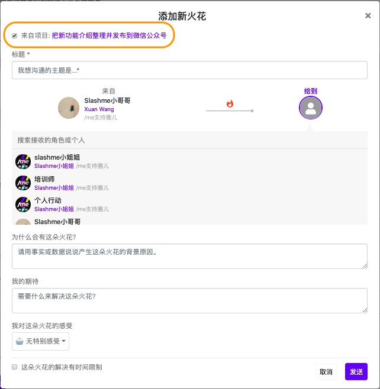

# 4.2 基于角色的项目协作

/me的一个非常核心概念就是基于角色的自我管理。每一位伙伴根据自己的角色定义来自主管理自己的工作，通过给其他的角色发送火花来进行协作。 

下面我们就来看一下如何在/me上进行项目协作。 

### 在项目下创建火花

当完成一个项目需要跟其他角色协作的时候，我们可以通过发火花的方式触发协作。 

1. 在一个自己角色的项目下，点击“+火花“按钮来创建火花。 


同样的创建火花的操作可以用最上方的蓝色+火花按钮或者是右下角的蓝色+按钮。


2. 在新弹出的火花创建界面上，可以看到这个火花会跟这个项目相关联，是由这个项目引发的。


1. 因为我们已经知道这个项目是哪个角色的，火花的发出者会预先设定好。同时，因为只有项目的负责的角色可以发出火花，所以这个发出者是不可以更改的。
2. 如果这个火花不是由这个项目引发的，可以直接点击项目名称前的小方框开取消关联。这个时候，可以自由选择火花的发出者。 


当发出的火花状态发生改变后，项目负责的伙伴可以清晰的看到这个火花的状态。 

