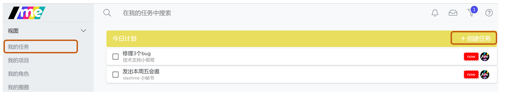
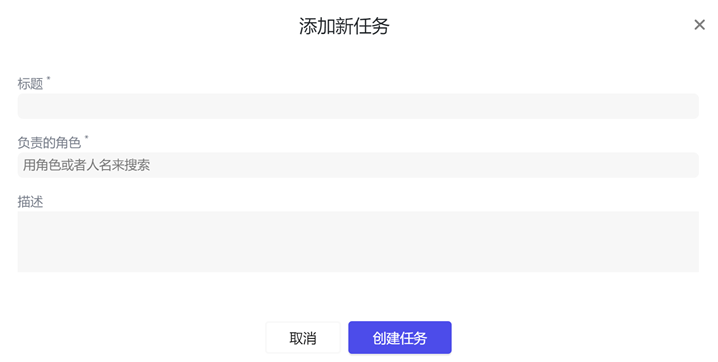
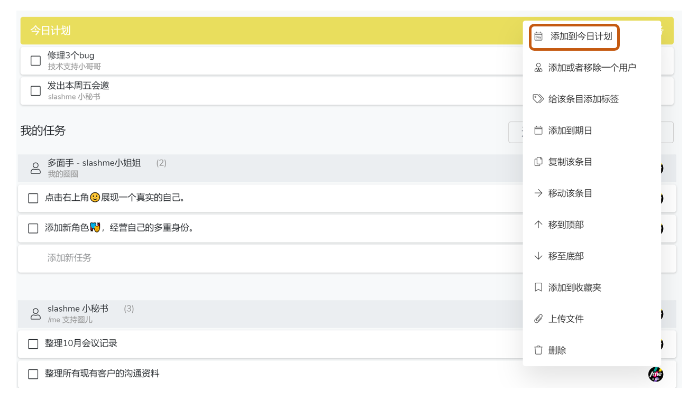
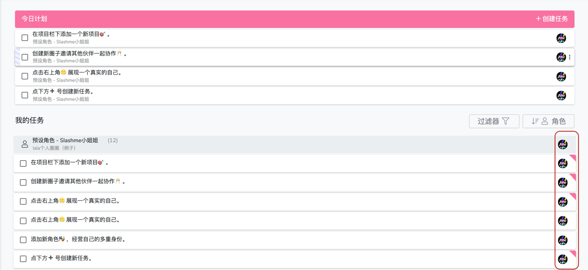
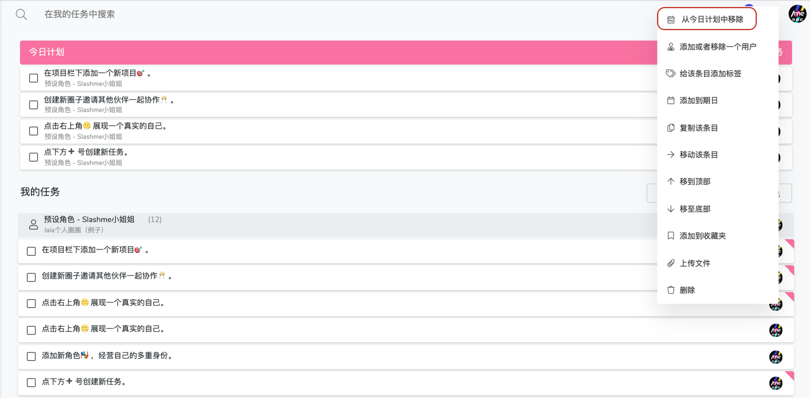

# 4.5 今日计划

**今日计划，帮助你更加有效管理个人工作，专注今天，今日事今日毕。**

在/me平台上，大家同时承担着好些角色，如何安排不同工作之间的优先级是一个很有趣的挑战。俗话说一天之计在于晨，时间要花在刀刃上。每天早上把今天需要做的从不同角色下的事情梳理一下，按优先级先后排序放在一起会很好的帮助大家聚焦在真正重要的事情上。


今日计划并不是指到期日是今天的任务。它的主要目的是帮助大家安排一天想要完成的任务。如果当天没有完成，这些任务在第二天也会保留在今日计划里。


### **在今日计划下添加任务**

第一步：点击左边栏**“我的任务”。**

第二步：在**“今日计划“**栏 右上角点击**”添加任务“。**

第三步：基于你不同的角色，添加任务到**”今日计划“。**

同时，该项任务也会显示在你相应角色的任务栏内**。**

**将已有任务添加到今日计划**

也可以把已经有的任务，直接添加到今日计划里。

点击你希望设置的任务右侧三个点，点击“添加到今日计划”**。**

### **常见问题**

1\. 如何判断一个任务已经添加到今日计划里了呢？

添加到今日计划里的任务的右侧会有一个带颜色的三角。

2\. 如何**将**任务从今日计划里移除呢？

可以点击该任务旁的”更多（三个点点）”操作来完成。

