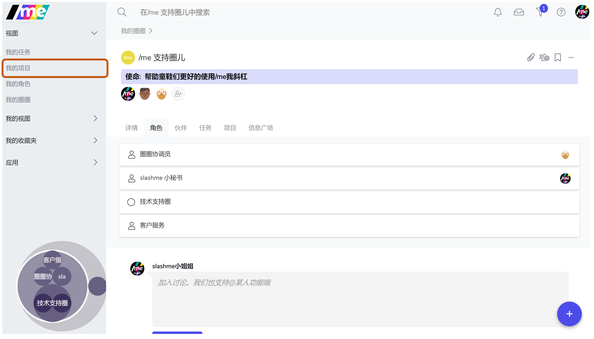
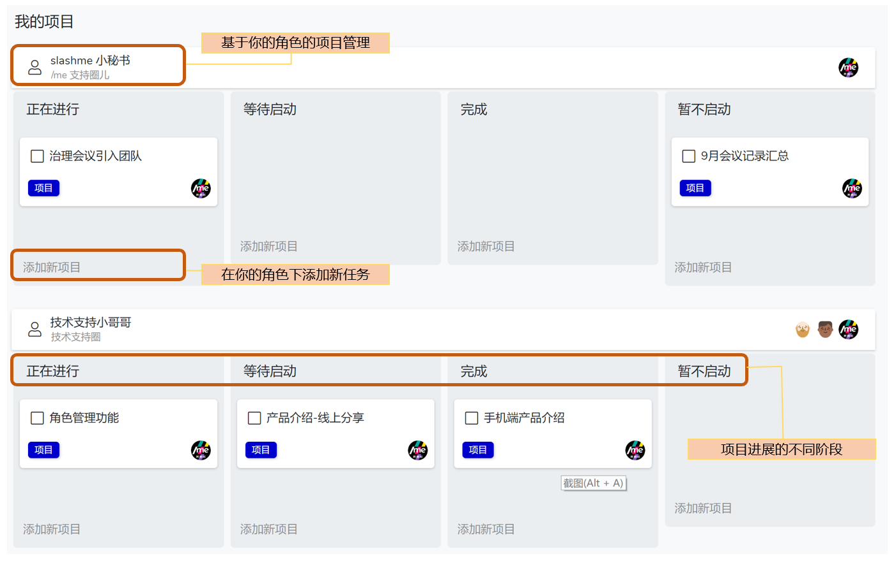
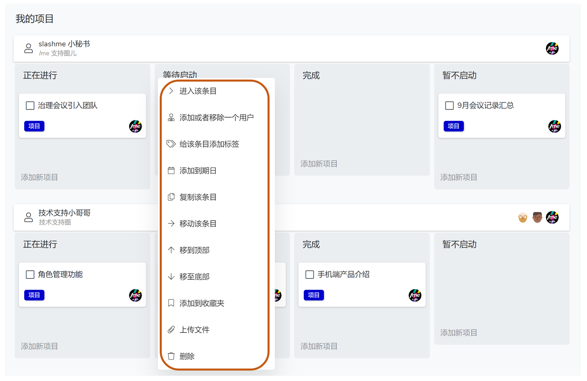
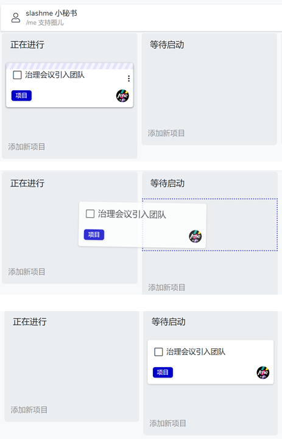

# 4.3 项目管理

当一个目标需要多个步骤/任务来完成或者需要与其他角色来协作的时候， 可以通过项目来完成。

### 我的项目页

你可以在任何场景下，通过左边栏快速进入“我的项目”：

基于角色的项目管理

### 添加项目的方式

* 你可以在任何时候点击右下角"+"按钮, **“添加新项目”**
* 你可以在任何角色的主页，点击**“项目”**栏，查看当前的项目，或**“添加新项目”**

**更多操作**

你还可以点击任意目标项目的空白区域，进入该项目主页，了解更多信息**。**

### **移动项目**

鼠标滑动到项目卡片顶端，出现淡紫色斜条纹，随机点住卡片， 拖动到其他目标空间**。**

