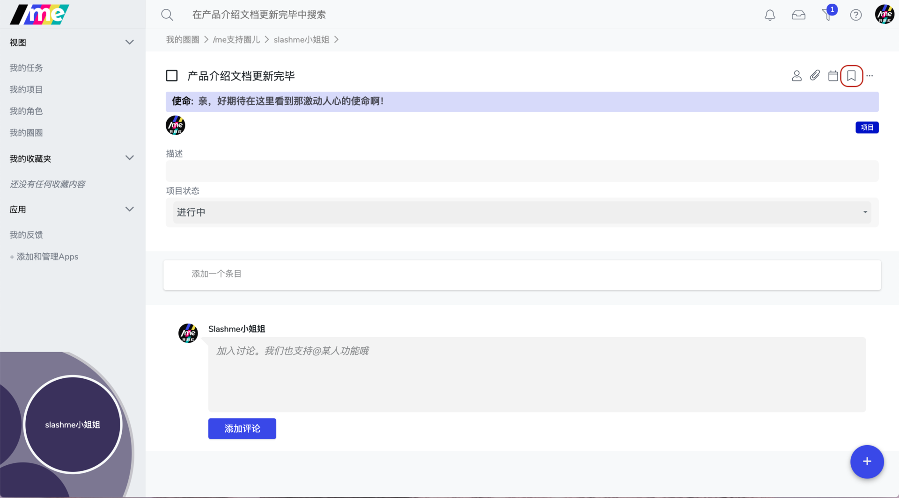
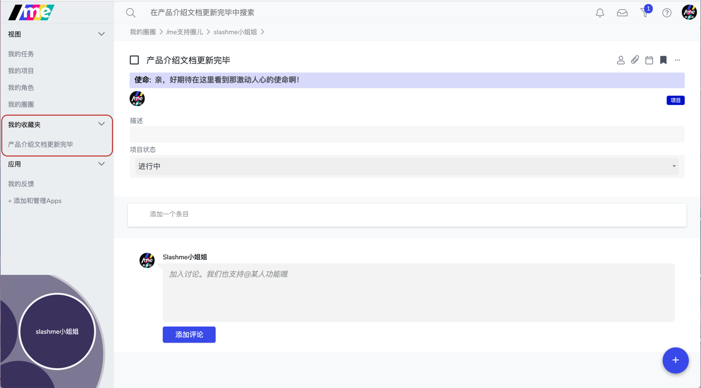
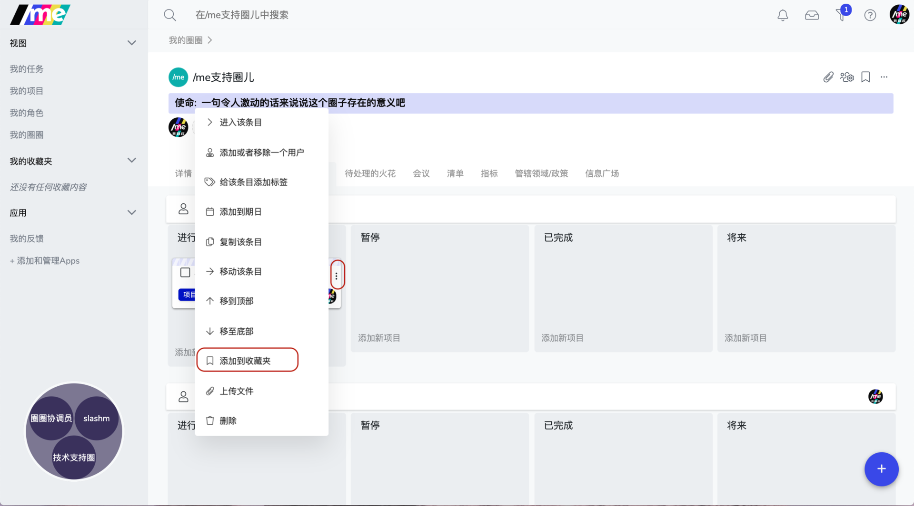

# 7.1 收藏夹

有些常用的链接，比如正在进行的项目，经常需要查看的记录，如果有个快速的入口就好了。

在/me平台上，我们准备了一个收藏夹功能，帮助大家实现这个小期待。

### 添加到收藏夹

在相应的条目页面，找到右侧的标签按钮。

点击后，可以在左侧导航栏里看到“我的收藏夹”下的相应链接。以后，点击这个链接就可以一键到达相应页面。

此外， 还可以通过点击一个条目上的三个点点按钮来添加到收藏夹。

​

