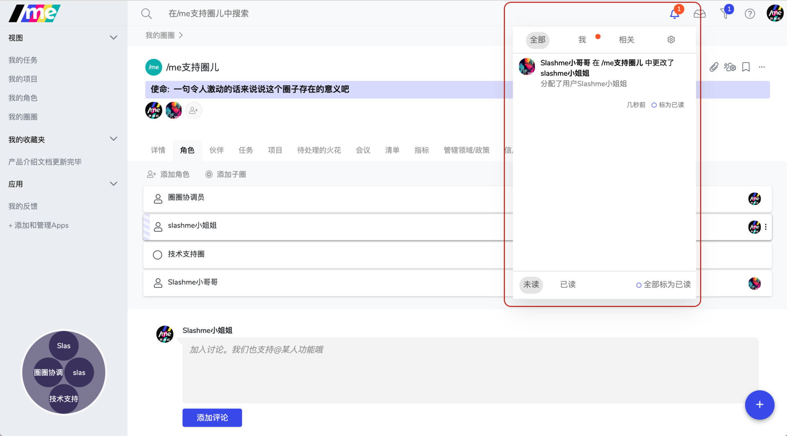
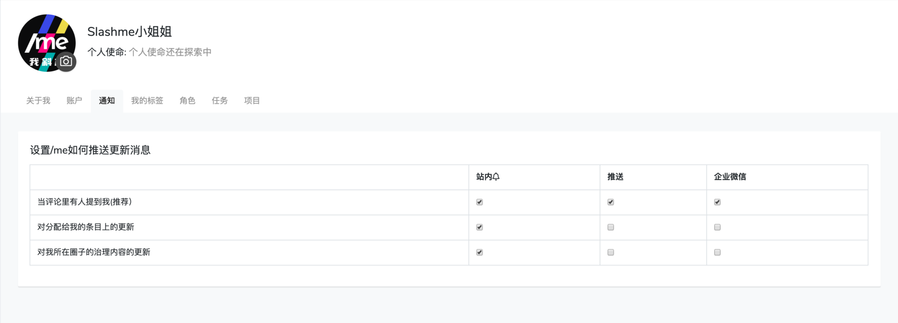

# 7.5 通知设置

在/me平台上协作，大家需要可以及时的了解对自己重要的更新，比如自己的圈子又有了哪个新角色，我角色参与的项目有什么新的进展。支持这个需求就需要了解一下通知功能。

### 查看通知

在电脑网页端，大家可以看到主界面右上方有一个铃铛🔔按钮，如果有未读通知，会以数字的形式表示出来。

点击这个铃铛，会出现未读的信息。点击任何一条信息，可以直接去相应条目。​

### 通知设置

点击上方界面的设置按钮，可以进一步设置通知的接收方式。

在“**通知**“页面下，你可以在下面几个不同环境下，设置你想收到什么样的推送通知。

* 站内消息（🔔）
* 手机app端推送
* 企业微信内推送

