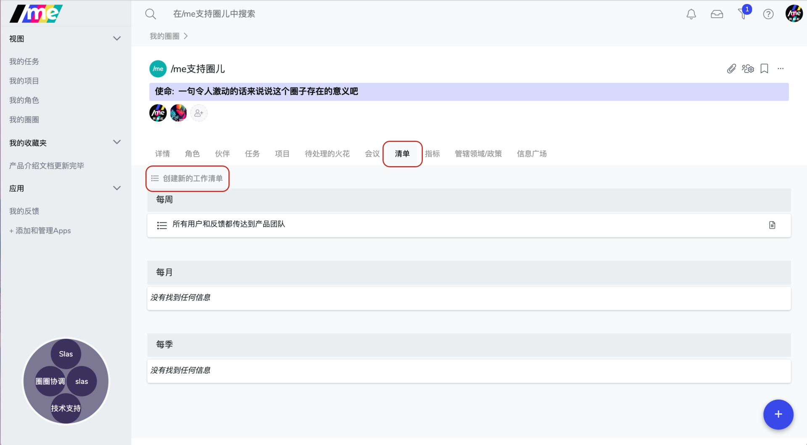
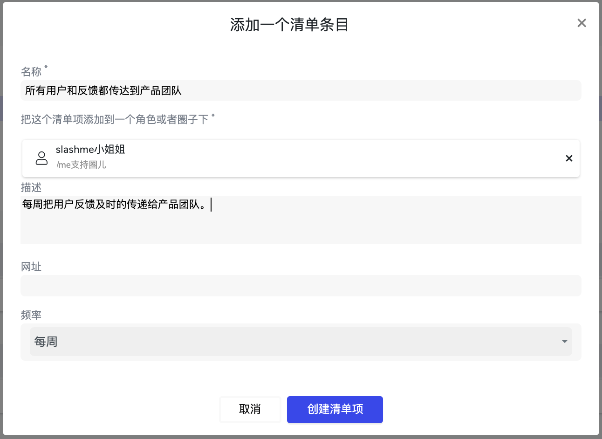

# 6.4 清单

### 什么是清单？

**一系列角色平时工作重复需要完成的任务。通过对这些任务完成情况的跟踪可以进一步帮助了解角色承担情况。**

* 它是一个在圈子内透明公开的信息
* 清单的内容应包含周期性角色或圈子计划达成的目标，以及实际达成的状况； 
* 建议清单可以在每次圈子的圆桌会议上被开放回顾和分享的信息； 
* 清单是以角色和圈子来设定的，而非个人

### **设置清单**

**第一步：**点击**“创建新的工作清单”**来进行清单的设置  
圈子和角色可以根据团队日常的工作，依据不同周期设定这些清单

第二步：在弹出的对话框里添加清单项的详细内容

