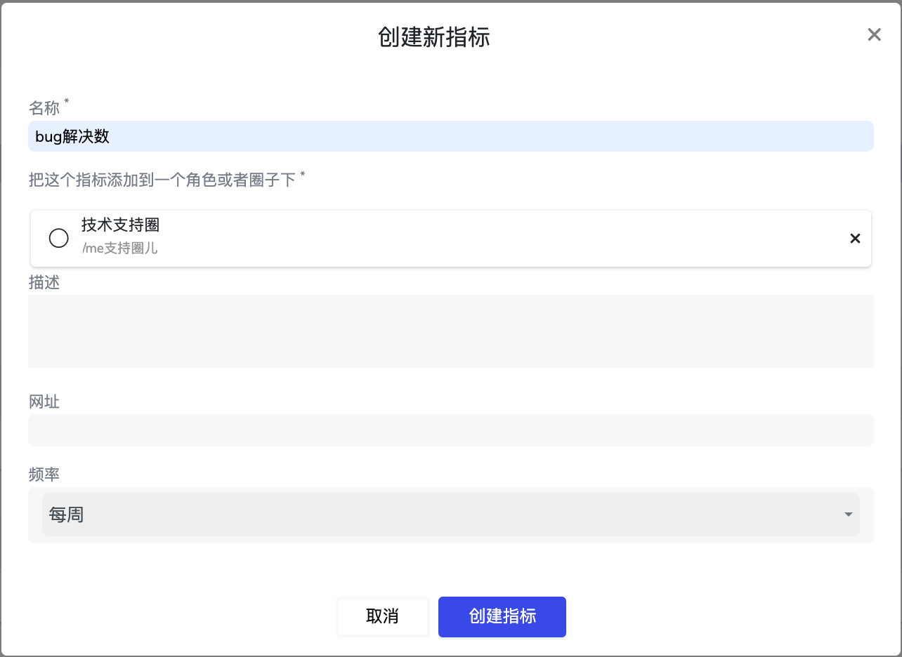

# 6.2 指标（数据）

### ​指标是什么？

**圈子或角色需要定期回顾的工作结果。是可被量化的，定期获得数据的，可被更新的，并对圈子或角色的使命有助 力和贡献的。**

* 它是一个在圈子内透明公开的信息
* **指标**的内容应包含周期性角色或圈子计划达成的目标，以及实际达成的状况； 
* **指标**是需要在每次圈子的圆桌会议上被开放回顾和分享的信息； 
* **指标**是以角色和圈子来设定的，而非个人

### 设置指标

点击“创建新指标”来进行指标的设置。  
圈子和角色可以根据团队日常的工作，依据不同周期设定指标。

第一步：点击创建新指标

第二步： 在弹出框里输入指标标题，哪个角色/子圈来负责更新这个指标。如果指标汇总在其他地方，可以在网址一栏输入相关的链接。

举个例子：

