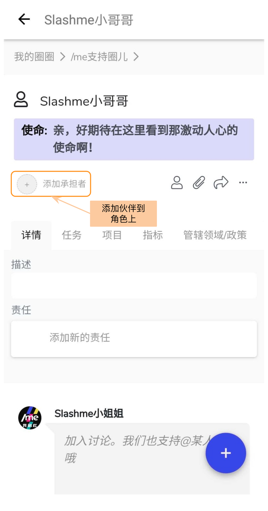
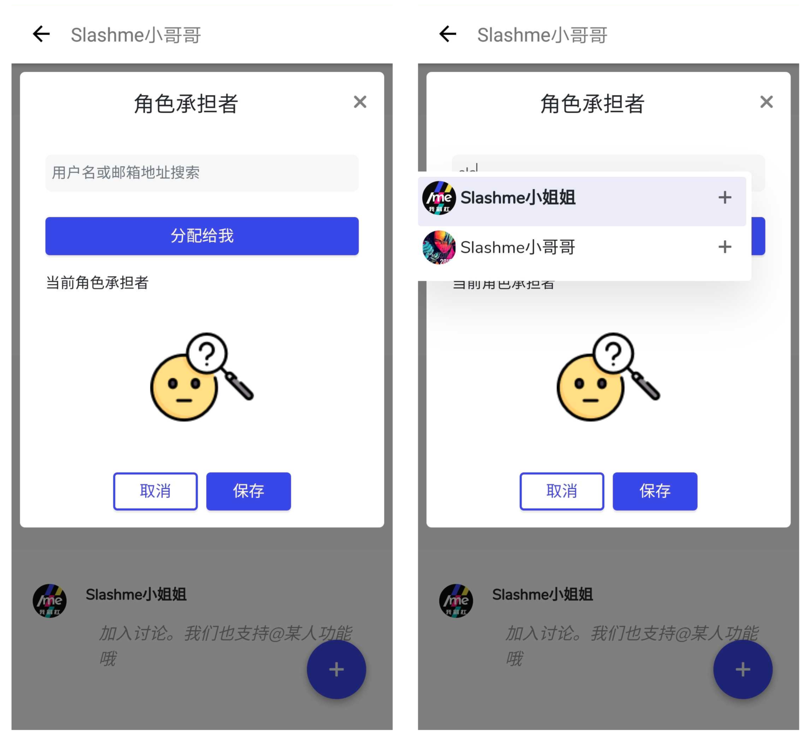
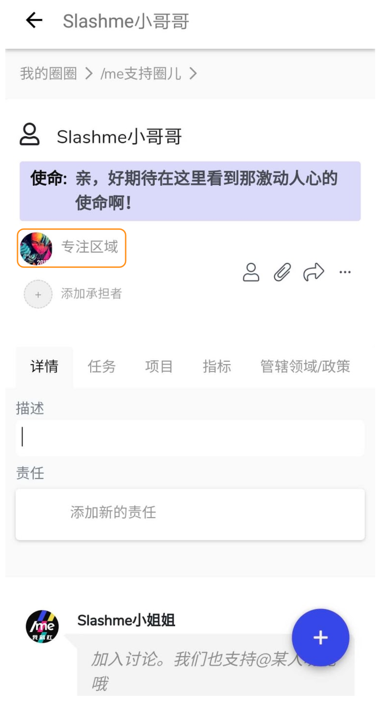
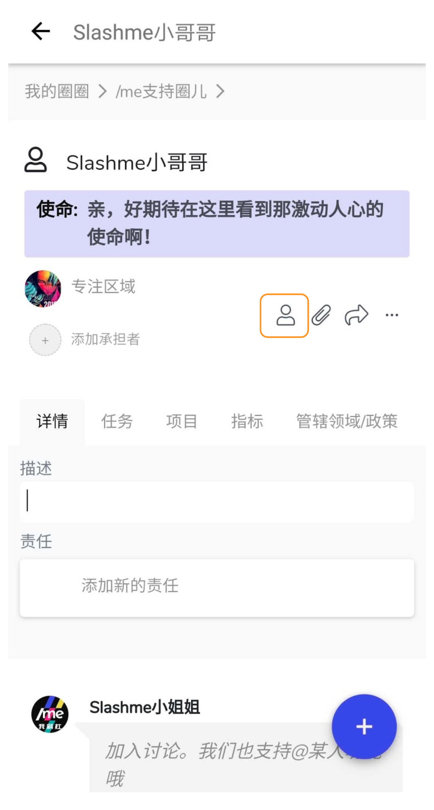
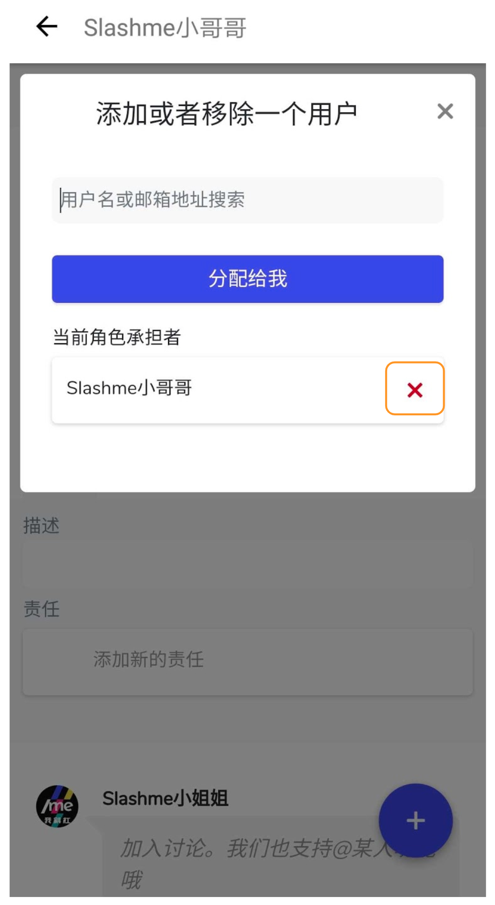

# 2.4 角色添加承担者

在/me平台上，每位伙伴会在一个或多个根圈下通过承担不同的角色来开展协作。

### **添加伙伴到角色上**

第一步：在根圈下，找到相应角色页面，点击“添加承担者”。

第二步：在出现的对话框，你可以直接将该角色分配给自己，或者输入其他伙伴的用户名称进行添加

第三步：伙伴的显示。


一个角色上可以由多位伙伴来承担。 这个时候，最好用专注区域来进一步划分每位伙伴负责的部分。比如说，销售的角色，专注区域可以是销售的覆盖范围，上海，北京等。


### **把伙伴从一个角色上移除**

第一步：进入相应角色页面，点击右侧功能栏- ”角色管理” 按钮。

第二步：在弹出的对话框里可以看到已经承担这个角色的伙伴， 在相应的伙伴名旁点击右侧“X"来把该伙伴移除。


只有当伙伴添加到圈子内的某个角色，则才会在圈子主页显示伙伴

原则上，/me 我斜杠 不支持加入一个圈子，但不承担角色的模式。也就是说，不能添加一位伙伴到圈子，但不承担任何的角色


