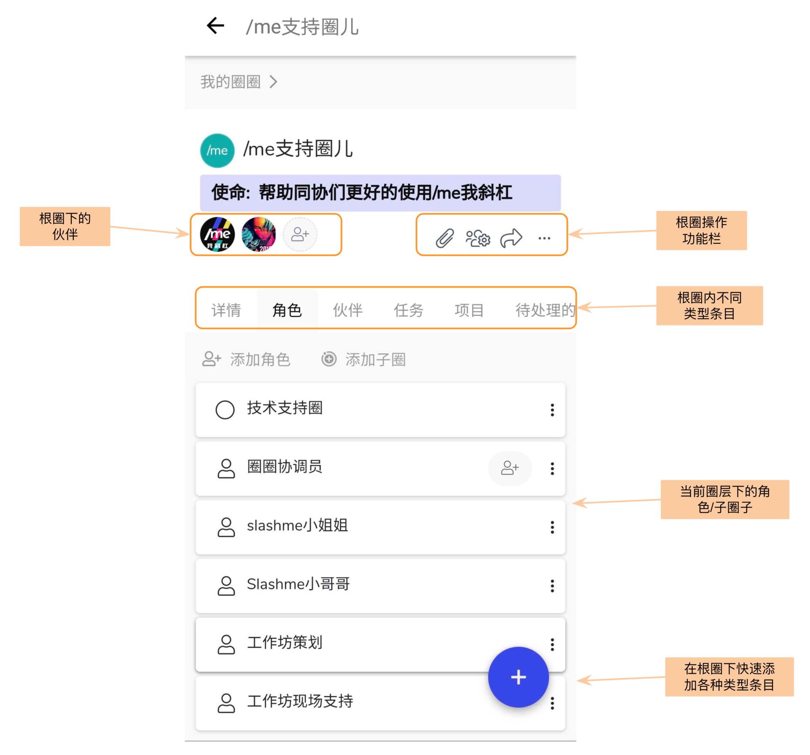
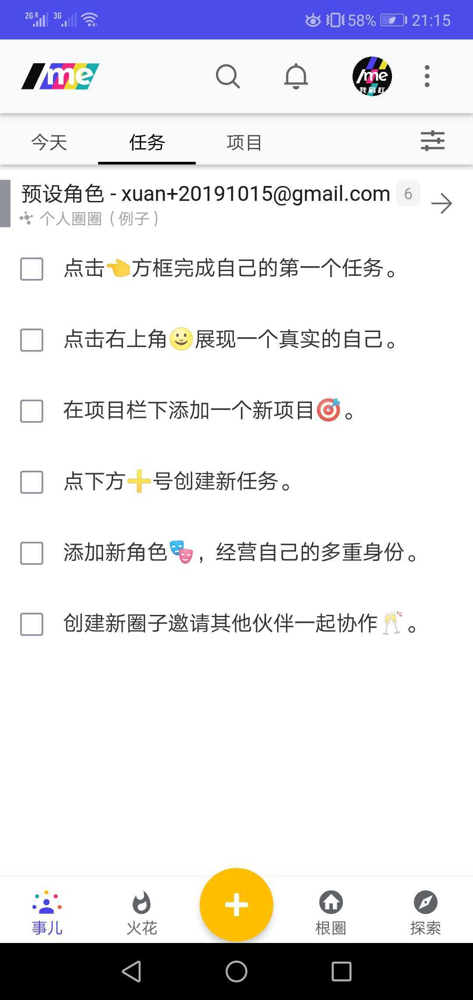
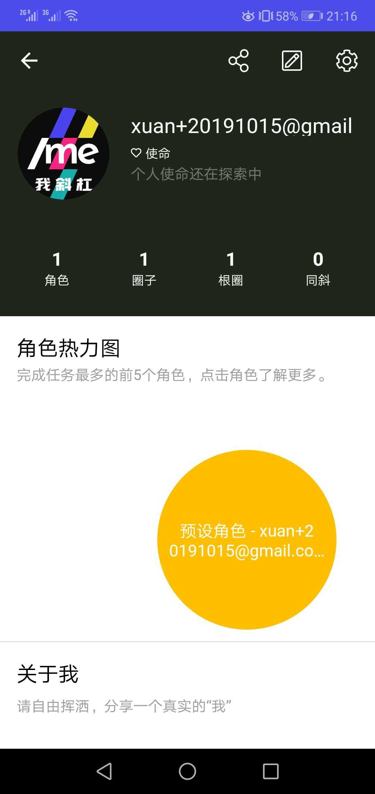
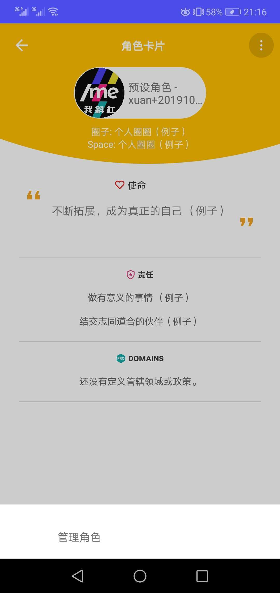
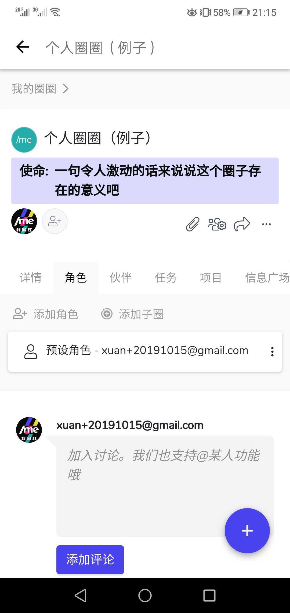
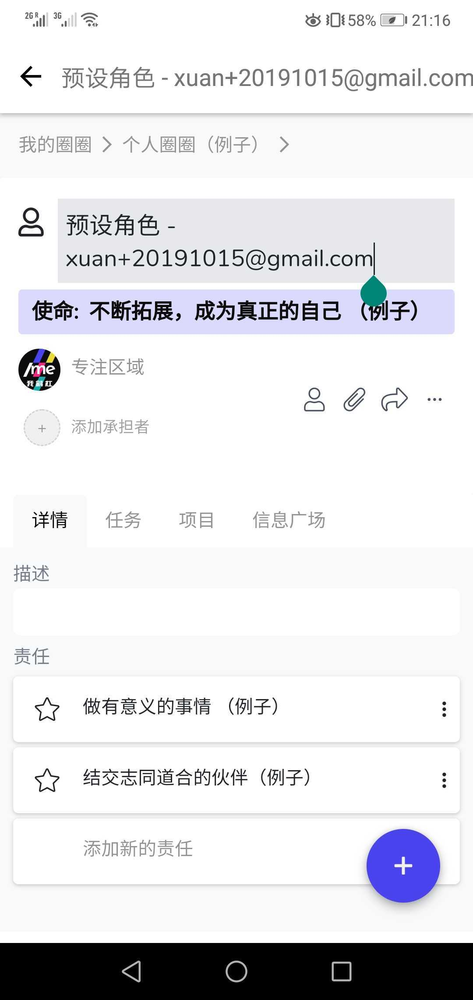
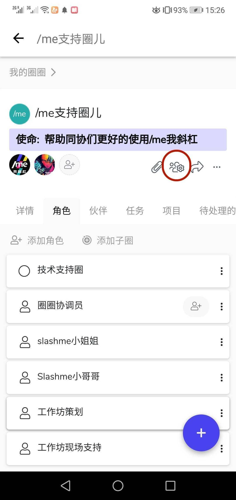
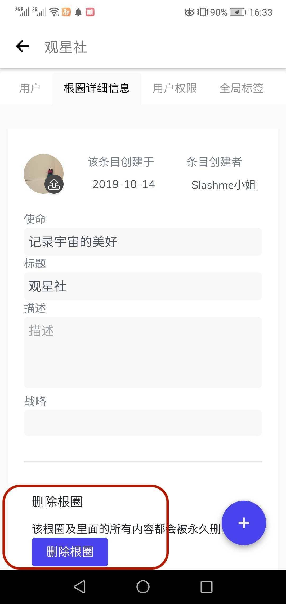

# 2.1 圈圈(根圈）简介

进入到一个根圈后，大家会看到很多内容。下面会对每一个部分进行简单到说明。

* **圈子内的伙伴列表：**显示该圈子内承担角色的伙伴。
* **圈子操作功能栏：**你可以添加附件/圈子设置/添加收藏，点击“...”可以看到更多功能
* **圈子基本内容分类：**点击不同的页面，查阅不同类型的信息\
  各页面详细定义和操作功能介绍请[参考这里](../../wang-ye-duan-shi-yong-zhi-nan/shi-yong-shou-ce/)。&#x20;
* **超级重要的 “+”功能：**
  * 右下角的“+”号按钮帮助你快速创建新圈子/新角色/新任务/新项目等。

### 例子根圈 - 从零开始熟悉根圈

每一位来到/me平台的新用户会在根圈列表上看到一个系统自动生成的例子根圈 - 个人圈圈。 在这个圈子里我们为大家预设了一个角色，并在这个角色下预设了几个任务来帮助大家更快的了解/me。点击这个根圈，可以了解更多和更改圈子里的信息。

### **给自己的角色换名字**

有两种方式，直接点击个人头像进入到个人页面下。点击预设角色后，进入到角色卡片页。点击右上角的三个点点来管理自己的角色。

第二种方式是直接点击该圈子进入到圈子内页后，点击角色名称后，在角色内页上修改。

如果不想要这个根圈，也可以直接删除它。具体的删除步骤请看后续内容。

### **删除根圈**


在/me平台，一个根圈负责人有权限删除整个根圈。 [**查看这里**](../../wang-ye-duan-shi-yong-zhi-nan/shi-yong-shou-ce/quan-zi-li-de-yong-hu-quan-xian.md)了解如何判断谁是根圈负责人。


第一步：在根圈子主页点击**“圈子设置”**

**第二步：**进入设置页面后，点击“根圈子详细信息”。 在最下面有删除根圈按钮。


* 根圈子一旦删除，所有信息也将全部同步被删除
* 如需提前下载圈子内相关信息或者想吃后悔药，请联系/me 客服小姐姐：wechat: iloveslashme 或者 help@slashme.com

