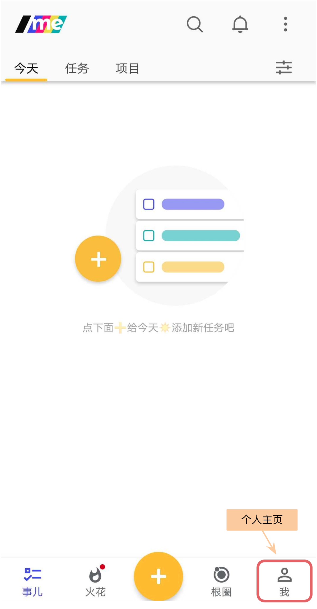
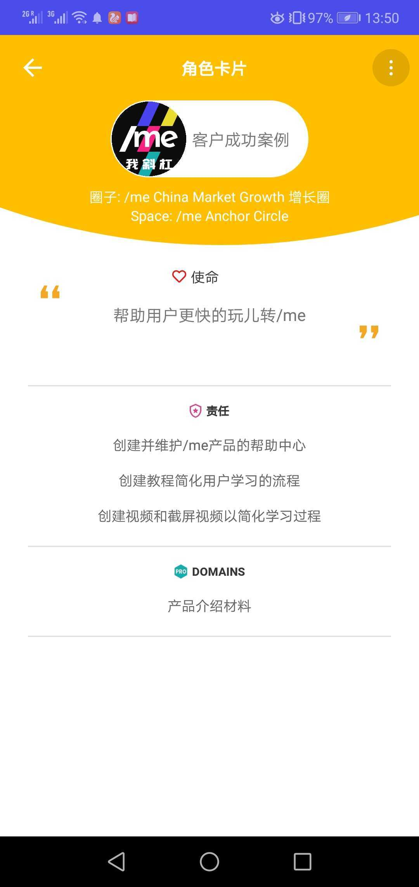
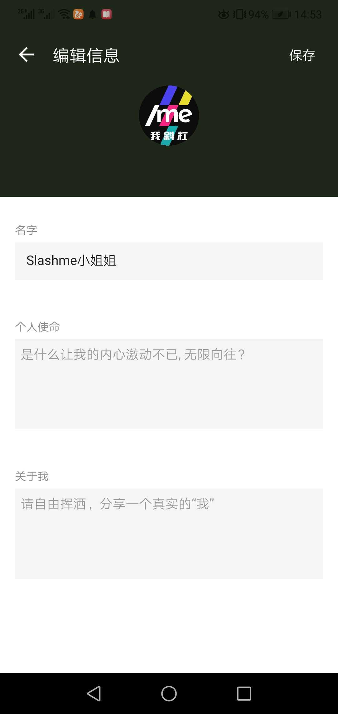

# 4. 个人页面

个人页面是每个伙伴的个人天地，除了基本的个人信息设置以外， 还可以通过了解关键数据的变化来帮助自己更好的重新“对焦”。

### 如何进入个人页面？

打开手机端，点击下方导航栏最右端的小人按钮。

### 页面简介

### 角色热力图及卡片

角色热力图会显示完成任务最多的前5个角色。完成的任务越多，相应的角色会更大。每个伙伴可以很直观的看到自己在过去的一端时间里整体哪个角色更活跃，花的精力更多。

点击每个角色可以打开相应的角色卡片了解更多。

### 编辑个人信息

点击图中的“编辑”按钮，可以进一步编辑，个人信息。

### 我的关键数据

点击上图的四个关键数据会进一步显示更多的相关信息。 这四个数据定义分别是：

* 角色：所有我当前承担的角色
* 圈子：我承担至少一个角色的所有圈子
* 根圈：我所在的所有根圈
* 同协：和我在一个根圈下的其他伙伴们

