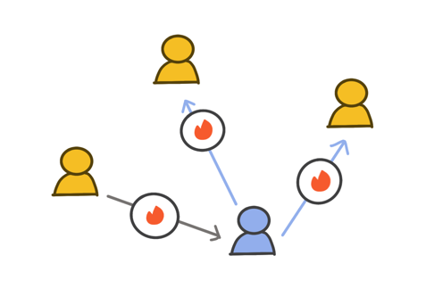
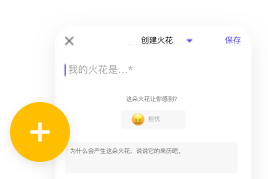
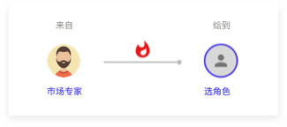

# 3. 我的火花🔥

### 什么是火花？

火花是帮助大家自发自主的一起推动把事儿办成的重要沟通协作工具。它帮助人们看到现状和未来的理想状态之间的差距。在协作的过程，不再是上级给下级发布任务，大家通过使用火花来开放的互动，表达对彼此的期待和需求。在不断的发出和解决火花的过程中，事情一步一步的向理想的状态发展。

> **例子**
>
> 1. 一个大家看到的机遇。 比如一个有客户支持角色的伙伴，他发现很多用户对某一个产品功能有强烈的需求。这个伙伴可以通过给承担产品定义角色的伙伴发去一个火花来提出这个建议，帮助产品不断的变得更好。
>
> 2. 一个向其他角色发出的需求。比如一个有市场推广角色的伙伴，他需要承担视觉设计的伙伴提供一套产品推广海报。
>
> 3. 一个期待或者反馈。比如有产品开发角色的伙伴可以期待产品设计的伙伴对功能需求的描述更完整准确，提高整体产品的开发效率。

火花可以发给一个已经明确的具体角色，未来也可以发给一个团队，或者/me平台上的其他伙伴来一同帮助做成一件事情。

### 火花的生命之旅

在/me，为了帮助大家更高效的沟通和协作，让对的人参与，在对的时间做对的决策， 每一个火花在提出之后，需要参与的角色都可以基于这个火花来充分展开针对性的讨论，记录完成它需要的下一步和了解它的进展状态。

一个火花会经历下面的四个状态：

#### 已发出

当一个火花被创建出来给到一个角色以后的状态。同时系统会发出一个通知给到承担这个角色的伙伴。

#### 已接受

当接到火花的伙伴同意接受处理这个火花之后，火花的状态就变为了"已接受"。 同时系统会给火花的发出者一个通知。

#### 已解决

当一个火花被解决后，解决火花的伙伴可以把火花的状态变成“已解决”。 火花的发出者也会得到一个通知来进一步证实。

#### 已关闭

当火花发出者证实火花已经圆满解决后，可以关闭这个火花，完成整个火花的生命之旅。

### 如何创建，发出一朵火花？

可以点击app下方中心的橙色+号按钮来创建一个新火花。除了填写火花的标题之外，大家还可以表达产生这朵火花的心情，背景信息以及详细的需求。 所有这些都是为了帮助参与解决这个火花的伙伴可以更低成本的来沟通。如果需要进一步的信息，可以使用下方的评论功能。

通过清晰的角色描述，选好这个火花是从哪一个角色发出的，同时在同一个圈圈下选择一个可以帮助解决这个火花的角色。

### 接受或拒绝火花

在自主的协作关系中，每位伙伴都有明确清晰的自己承担的角色和责任。在接到一个火花的时候，火花的接收者可以先判断这个火花是不是自己的角色职责范围内的。如果不是的话，可以拒绝这个火花。

