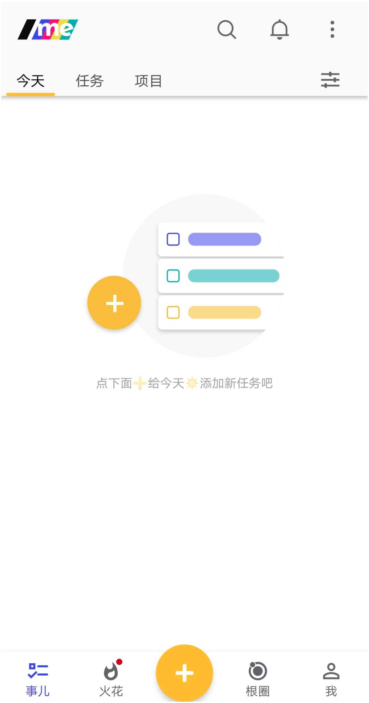
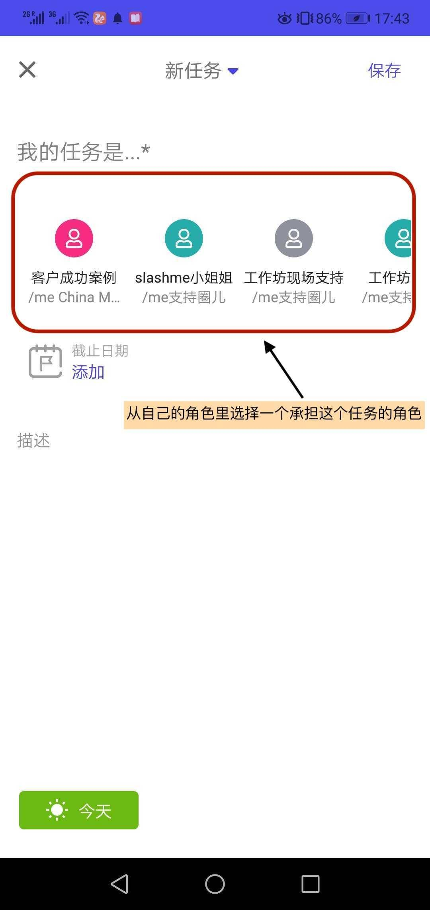
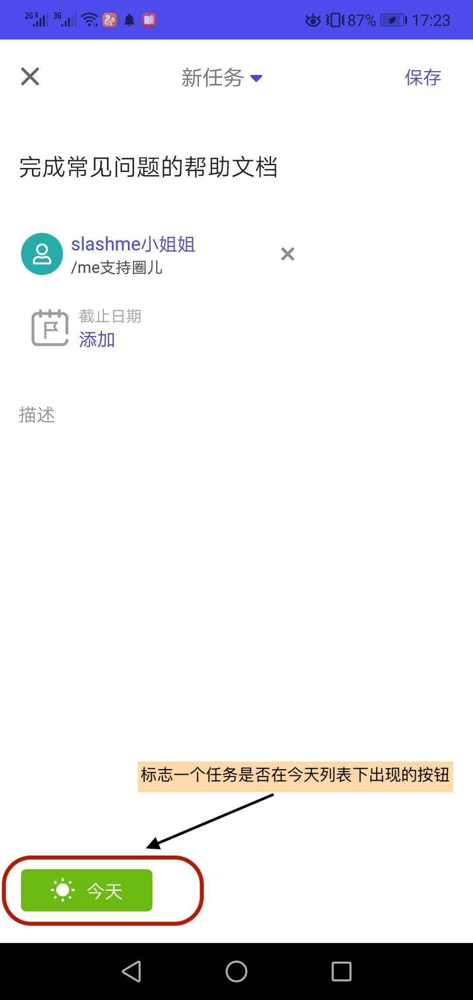
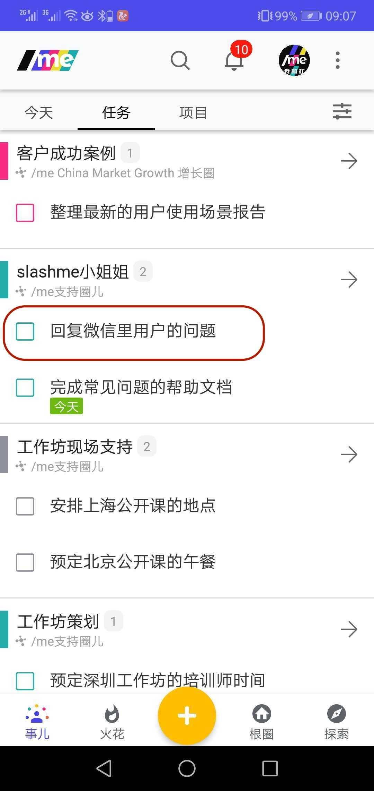
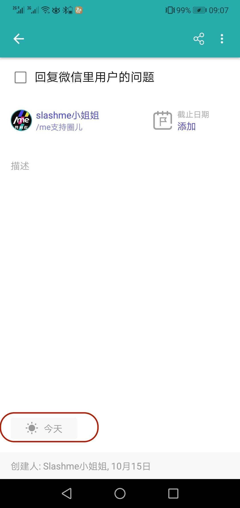
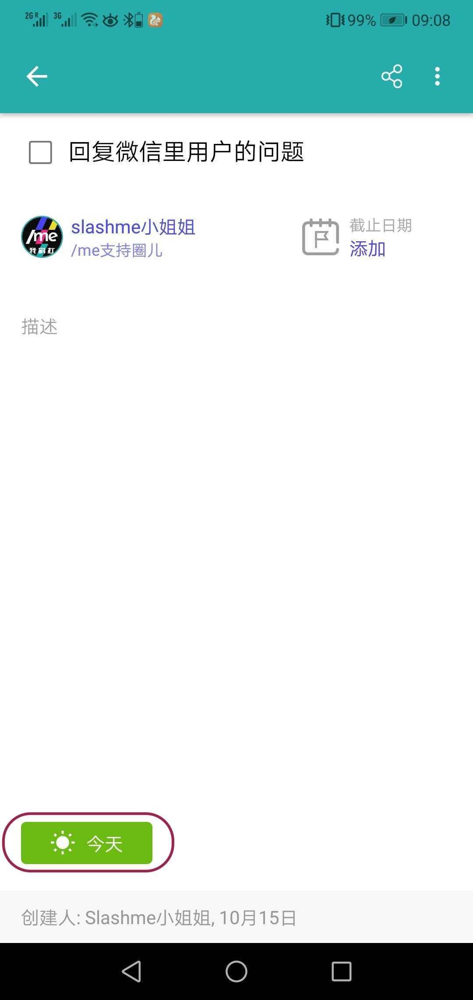
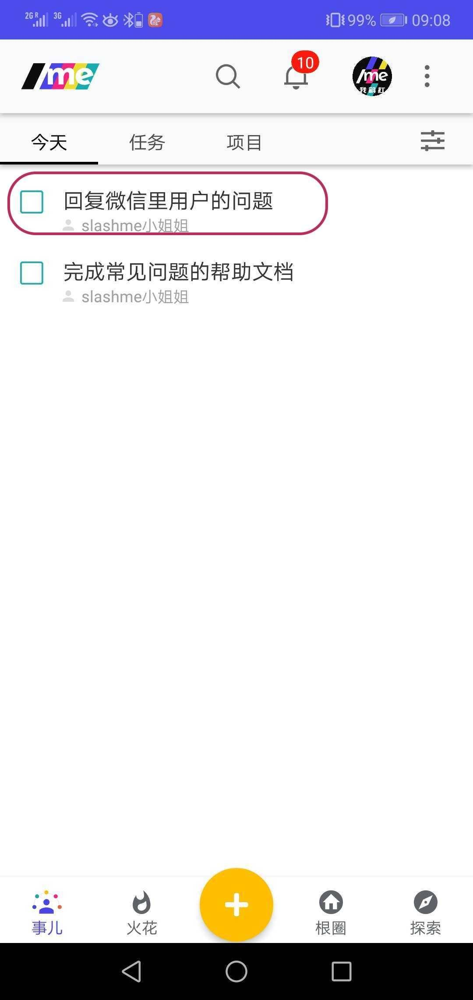
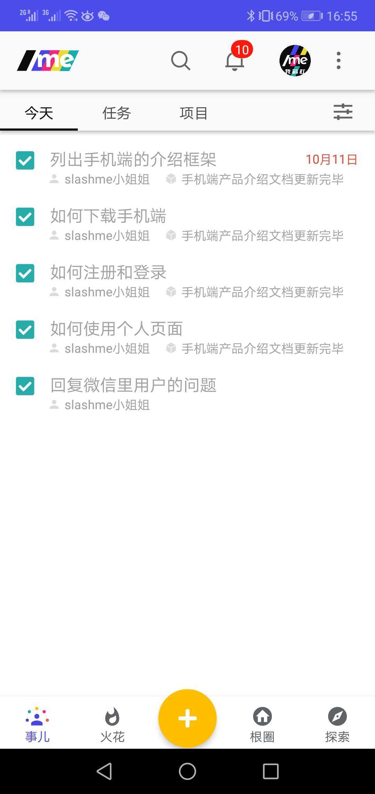

# 3.3 今日计划

**今日计划，帮助你更加有效管理个人工作，专注今天，今日事今日毕。**

在/me平台上，大家同时承担着好些角色，如何安排不同工作之间的优先级是一个很有趣的挑战。俗话说一天之计在于晨，时间要花在刀刃上。每天早上把今天需要做的从不同角色下的事情梳理一下，按优先级先后排序放在一起会很好的帮助大家聚焦在真正重要的事情上。


今日计划并不是指到期日是今天的任务。它的主要目的是帮助大家安排一天想要完成的任务。如果当天没有完成，这些任务在第二天也会保留在今日计划里。


### **添加”今天”下的新任务：**

第一步：点击app下方导航的**“事儿”。**默认出现今日计划列表。

第二步：点击下方的橙色按钮直接**”添加任务“。**

第三步：选好承担的角色后，按右上角“保存”按钮


该项任务也会显示在你相应角色的任务栏内。


### **将现有任务设置成“今日计划”**

也可以把已经有的任务，直接添加到今日计划里。

第一步： 在“任务”栏下，点击你希望设置的任务，进入到任务内页。

第二步： 在任务内页里，点击“今天”。

这个任务就会出现在“今天列表”下。

### **查看今天已完成的任务**

如想看一下今日的战果，可以点击右侧的筛选功能。

状态栏下，选择“已完成的”

所有的今天已完成的任务都在这里啦。

