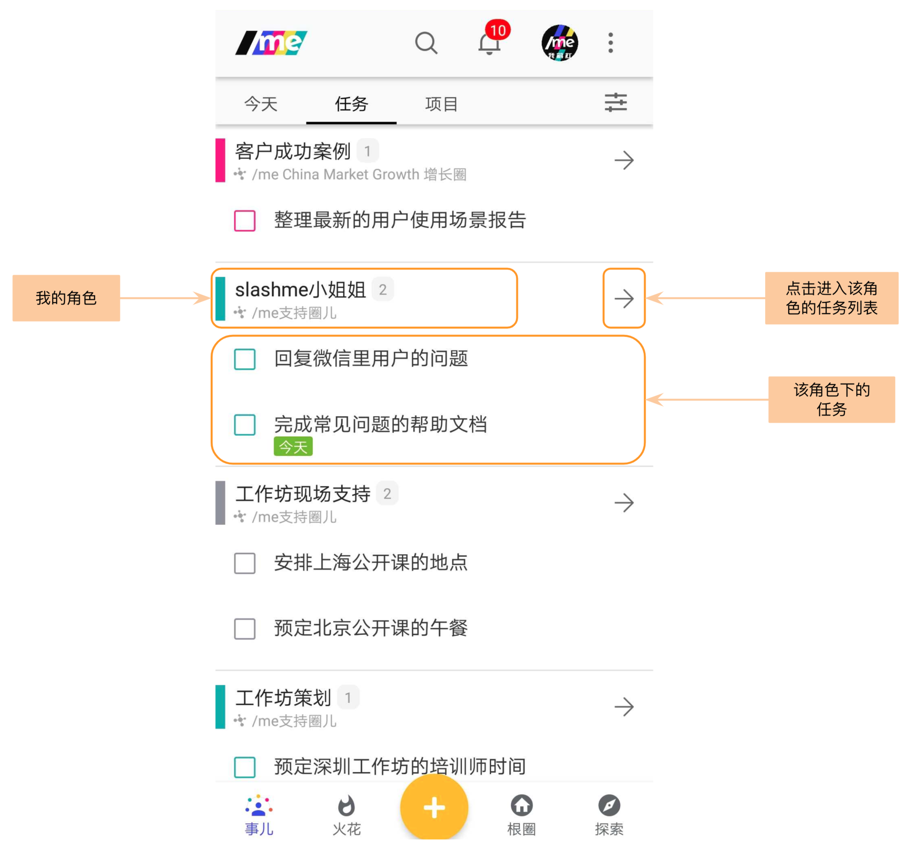
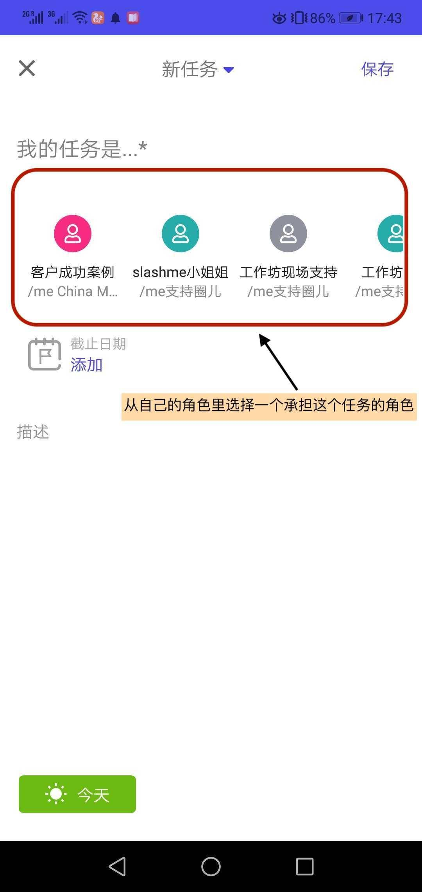
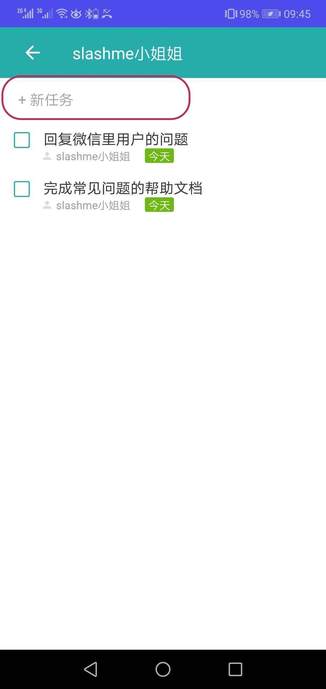
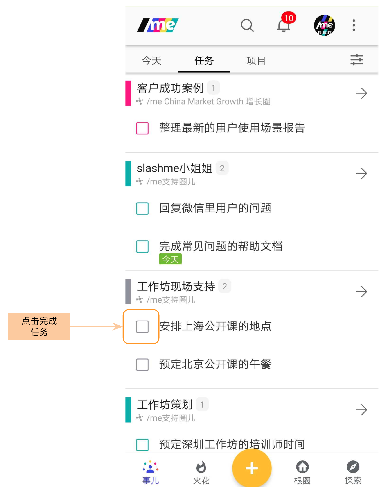
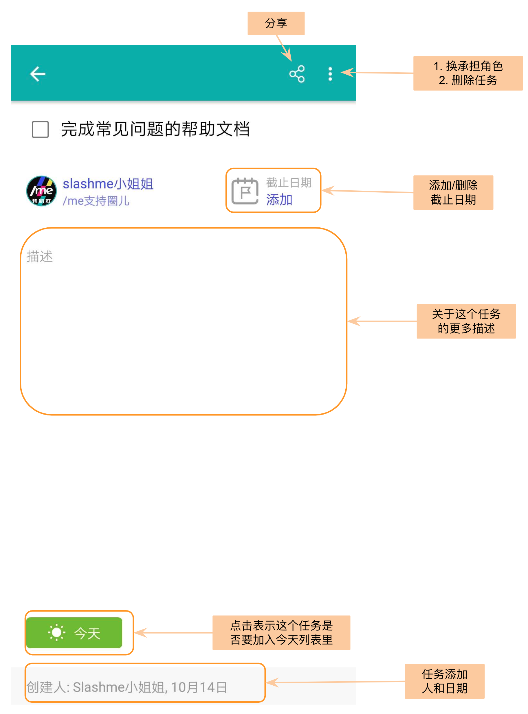
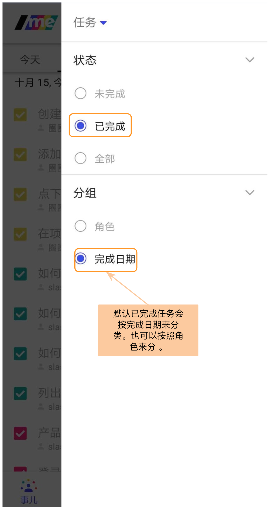
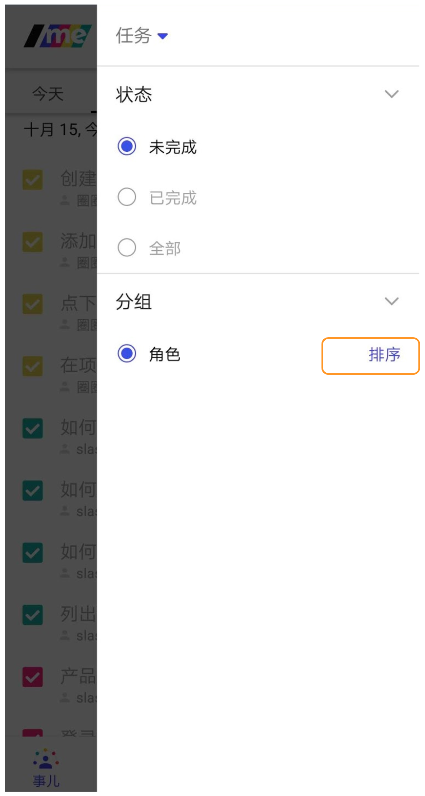

# 3.2 我的任务

/me平台支持新的自组织的工作方式，每个伙伴可以根据自己角色的定义来安排自己的工作。 工作内容是通过在不同角色下创建任务/项目来完成的。

本篇我们介绍任务的使用方法。

### 我的任务

基于我承担角色的任务管理

### 添加任务的方式

点击下方的橙色"+"按钮, 添加任务

点击某个角色进入到这个角色下的任务列表来添加新任务

### **完成一个任务**

当一个任务完成后，可以点击任务前的方框来完成这个任务。


默认当一个任务被完成后，这个任务会被隐藏。


### **更多关于任务的操作**

进入到一个任务到内页后，可以进行更多关于该任务的操作

### **查看已完成的任务**

如想看已完成的任务，可以点击右侧的筛选功能。

在状态栏下，选择“已完成的”选项。

所有已完成的任务都按照完成日期显示在这里啦。

### 按角色排序

有好几个角色的时候，可能某一段时间某个角色比较活跃，我们可以随时按照自己的心意给角色排序。

第一步，点击筛选按钮，在“角色”旁点击“排序”按钮

第二步，在出现的角色列表上，长按选中需要挪动的角色，然后拖拽到相应的位置上。

