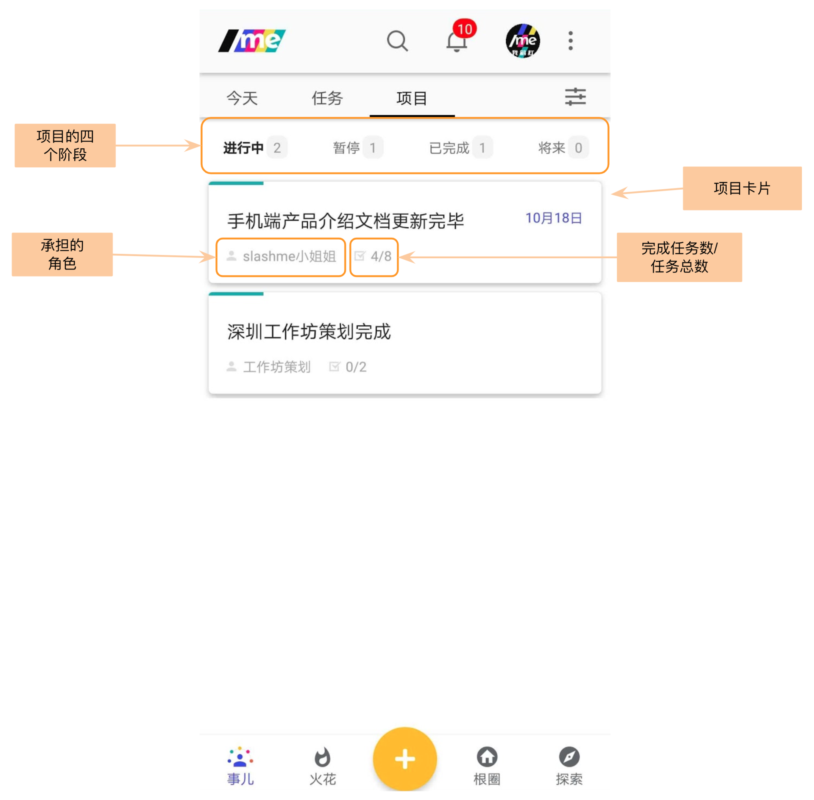
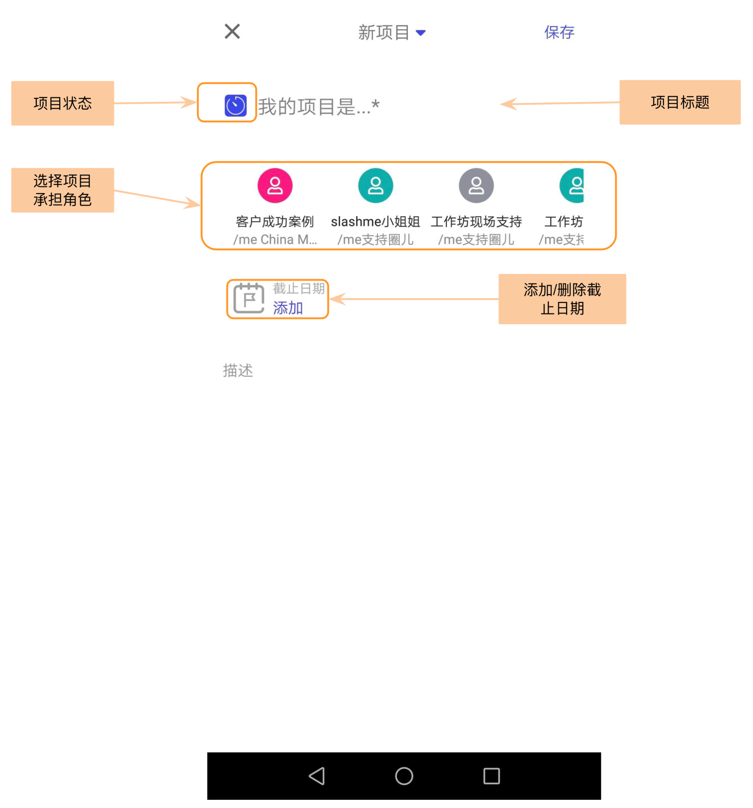
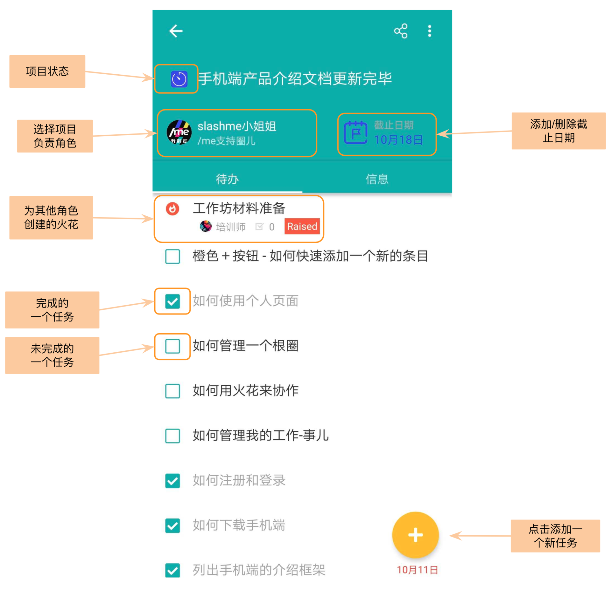

# 6. 我的项目

当一个目标需要多个步骤/任务来完成或者需要与其他角色来协作的时候， 可以通过项目来完成。

### **我的项目界面**

点击下方第一个“事儿”， 点击进入“项目”：

一个项目会处于四个状态中的一个：

* **进行中**：你正在做的项目
* **暂停**：这个项目之前在做，因为在等待其他角色的输入或者一些外部因素，或者优先级暂时降低。一旦这些障碍扫除后，这个项目就可以继续进行了。
* **已完成**：项目已经圆满完成了
* **将来**：一般因为这个项目的优先级比较低或者资源消耗比较大，暂时不考虑花时间在这个项目上。

### **添加项目的方式**

在项目栏下，点击下方的橙色"+"按钮来添加新项目


如果需要更换项目状态，点击项目标题前的项目状态按钮可以切换。


### **如何通过项目来协作**

在/me平台上，为了让责权更加清晰，每个项目根据一个角色由一个角色负责，在这个项目下，负责的伙伴可以：

* 给自己的角色添加多个任务
* 通过给其他的角色发送火花来一起协作

