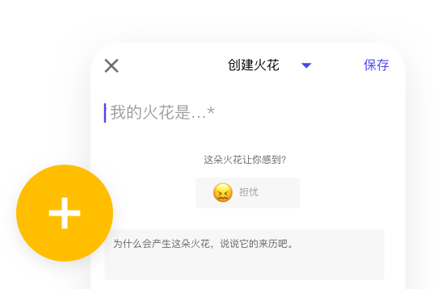
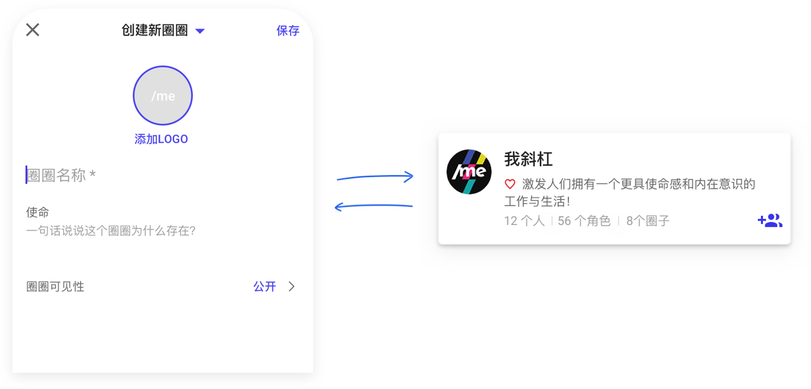
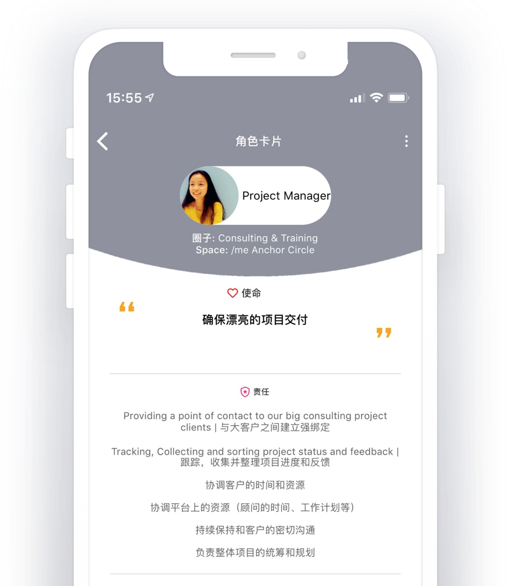
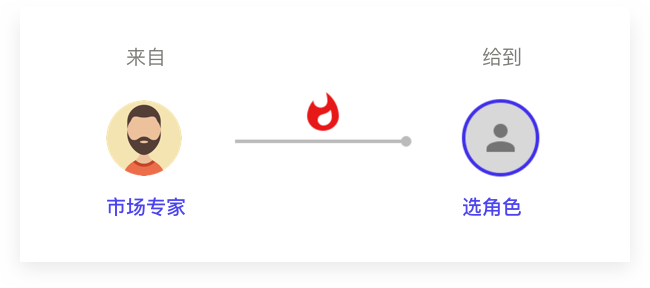
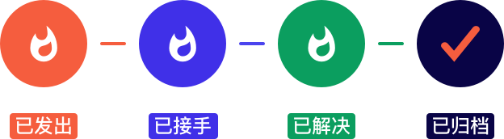
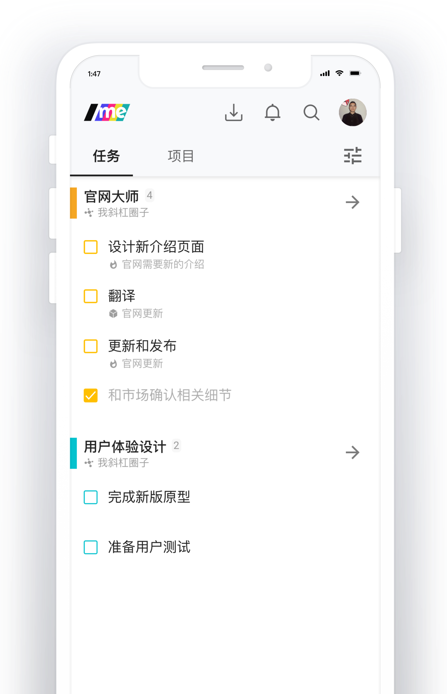
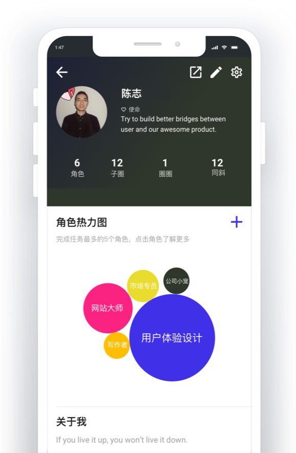

# APP实用指南📱

## **/me都有什么功能，以及我能怎么用 ？**

无论来自公司、社群还是社区，如果你是第一个加入/me的，你的/me就是一张白纸。

你需要点击“+”号按钮，来开始创建一些东西。

### **🥳** **创建圈圈**

**可以模糊地理解“圈圈”就是“小组”，是一群人在一起做事儿的空间**。

只不过，我们更加在乎圈圈的意义。在创建的时候，/me会要求你“一句话说说这个圈圈为什么存在”。

用一句话来描述非常重要，因为仅仅依靠圈圈的名子，并不容易使参与者达成做事儿的共识。

对目的的准确描述，可以帮助未来更多的参与者在加入圈圈时了解每个圈在整个组织中的位置和意义。防止出现不少公司里那种“我们做这个事儿都不知道是为啥”的情况。

所以，第一步，要建立一个使命目的鲜明的圈圈。

### **🎭** **创建角色**

为了达成圈圈的使命，角色是必不可少的。

一件事儿谁来做、谁负责，不是以人为单位的，而是以角色。**因为“角色”概念的基础，是明确的意义和责任范畴。**

所以角色是不能凭空产生的。它要属于某个圈圈，让自己的意义和圈圈的使命对齐，让自己的权责范围和圈圈的需求契合。

建立清晰的角色和圈圈的目的是一样的，让自己和别人都清楚自己在这个圈圈里是干什么的。这样，自己找别人或者别人找自己协作时，大家都清清楚楚、一目了然。

所以，在做任何事情前，你是谁不重要，清晰的角色最重要。

加入圈子后，请建立你的角色。从现在开始，请在/me上以角色示人。

我们欢迎一人分饰多角、以及记得邀请你的伙伴加入你的圈子，不然一个人在圈子里会感到孤独。

### **🔥** **创建火花**

火花，因碰撞而起 💥。

当角色之间出现了碰撞，就要有火花产生。一个角色为了实现自己的意义和其他角色产生碰撞，这就是火花；**它帮助人们看到现状和未来的理想状态之间的差距。**

* 火花可以很简单直接：产品设计角色邀请市场销售角色测试beta版产品并提出建议。
* 火花也可以模糊和复杂：产品设计角色请市场销售角色帮忙找到产品的100名超级粉丝。

前者需要简单的执行，后者需要火花接受者思考“超级粉丝”的定义、探索找到他们的方式，并由此制定可能需要更多协助者加入的市场活动方案。

创建火花和布置任务不同的是：创建者和接受者之间不存在上下级关系；如果接受者认为自己的角色和意义与火花不匹配，可以拒绝接受；一旦火花被接受，如何满足和解决火花是由接受者自主决定的。

一个火花会经历创建、接受/拒绝、解决和关闭火花四个阶段。

在“火花”页面，你不仅可以看到与自己相关的火花，还可以在“火花集市”看到组织里其他角色之间发生的碰撞。

看看火花的数量和类型，就能感受到一个组织的活力。

现在，基于你的角色，给你需要协助的角色创建火花吧～

### **✅** **做事儿**

接受的火花可以转变成相应角色需要做的事儿，当然每个角色也有很多自己本身的任务和项目要做。

在“事儿”页面里，/me帮助你创建和整理不同的事情。

实际上，它就是个to-do list，只不过它是以角色来划分不同的事儿的。

/me始终强调每个人要清醒自主地做事情，极力避免那种“自己忙了一天不知道为啥忙”的感觉。每一件在“事儿”页面的任务，都属于清晰定义的角色；不是为了做事儿而做事儿，做事儿都是为了明确的、与组织使命对齐的意义。

所以，创建任务的时候一定要想好哪一个角色在做事情；创建项目的时候，同样遵循角色为本的原则。

试试看，这样的to-do list是不是比其他产品，更容易帮助你时刻保持头脑清醒。

### **👤** **个人页面**

在/me系统中，人的价值评价体系不再和职位体系挂钩了。传统公司中，经理就是比员工地位高、评价高和薪酬高的体系在/me不复存在。

一个人的价值是他全部角色价值的总和。

在/me个人页面，我们展示了个人的意义感和他过去一段时间的角色热力图。

通过热力图，我们能很直观地看到，这个人都把时间花在了什么角色上，他分配精力的方式和组织、和他自己的意义感是不是匹配的。

这能够有效地帮助每个人反思和进化。

这些沉淀的行为记录比任何阶段性的主管评价都更加真实。

所以，在/me上做一些事儿之后，再回来看看你的页面，它会给你看待自己和工作的新视角。

更多具体操作，请见后续章节。

## **想了解更多？**[**💓**](https://emojipedia.org/beating-heart/)

[/me 官网 -&gt; slashme.com](https://www.slashme.com/)

