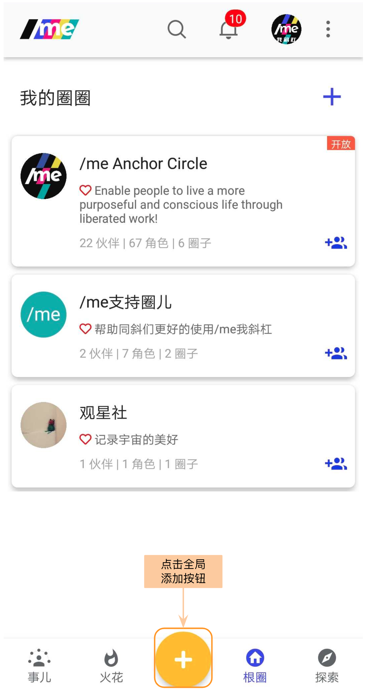
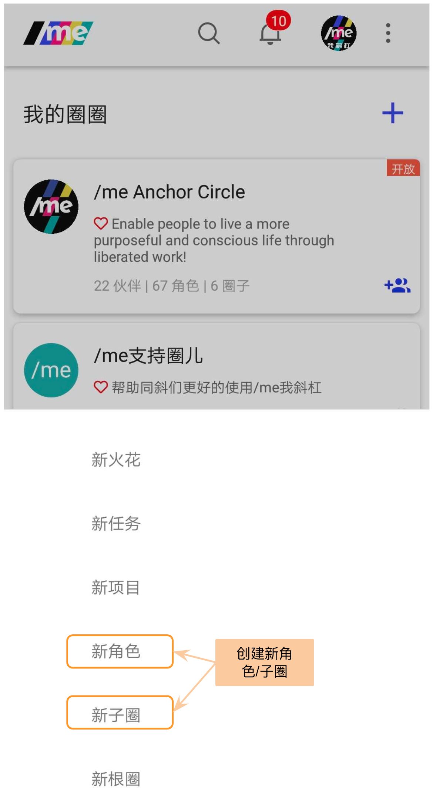
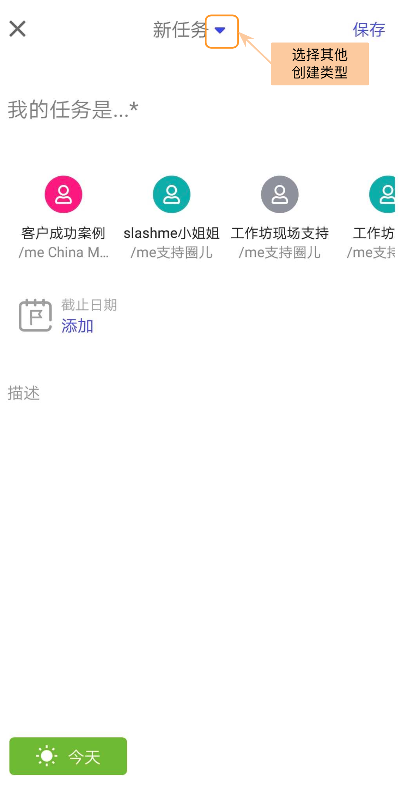
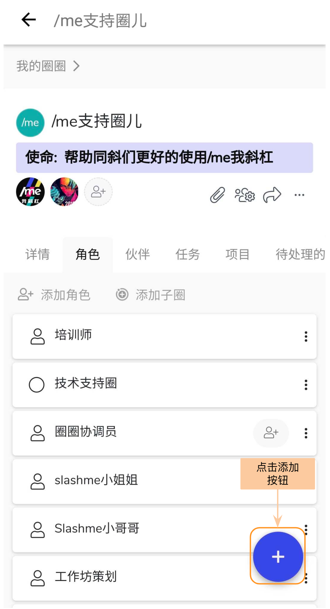
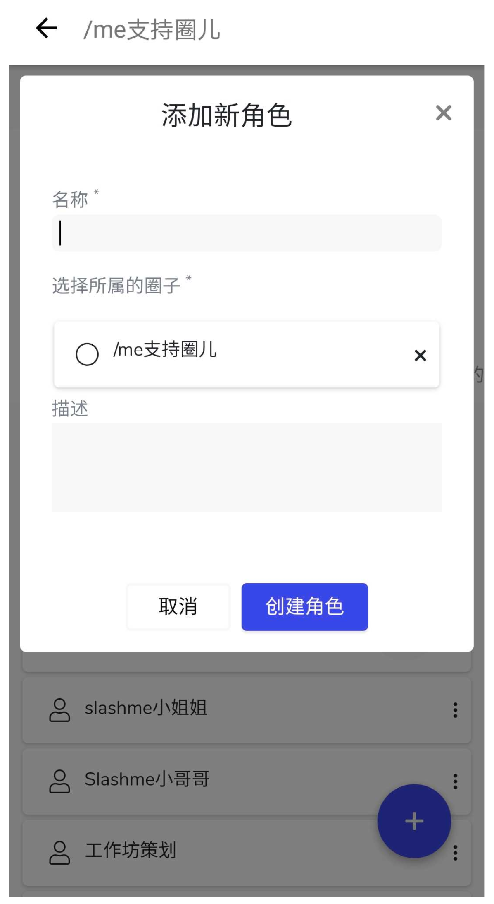
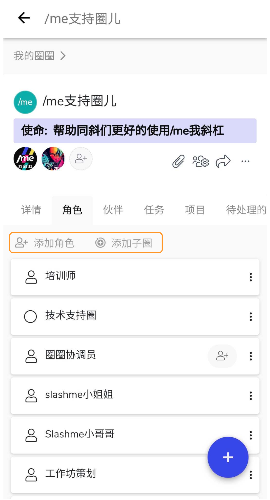
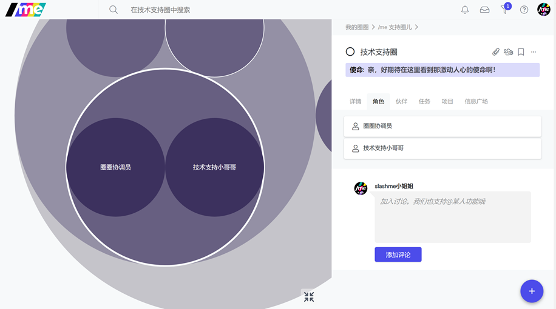

# 9. 创建子圈及角色

欢迎来到全新的团队协同模式和组织架构：圈子与角色

若想了解更多关于“圈子&角色”的设计逻辑，运行方式，和有趣的实践案例，请点击**《繁荣自组织基本原则》**

### **添加圈子/角色**

在手机端，有三种方式添加子圈/角色。

第一种：直接点击下方的橙色按钮，在弹出框里选择新角色/新子圈


橙色按钮在不同的模块儿下的行为会不同。比如在事儿模块下打开，会先显示创建任务的界面。 这个时候，可以在创建界面上方点击小三角按钮来转换需要创建的条目。


第二种：如果在根圈模块儿下，进入你想要添加圈子/角色的圈子，点击右下加”+” 按钮，选择添加子圈或角色。

在弹出列表里选择“新子圈”/“新角色”，在新的对话框里输入相应的信息。

第三种：或者，直接在角色页面下添加

添加好角色后，可以直接在角色列表下看到。 在电脑端，你可以看到组织架构的变化。

这也正是/me 我斜杠支持**敏捷动态开放组织模式**的重要功能哈~

