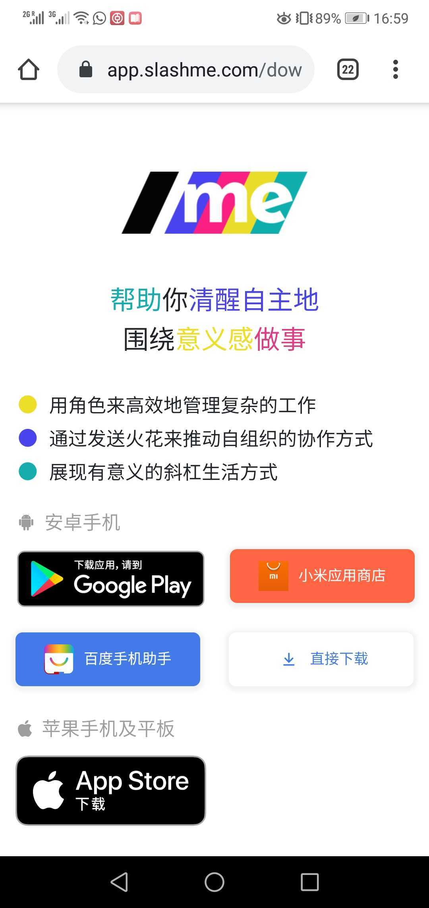
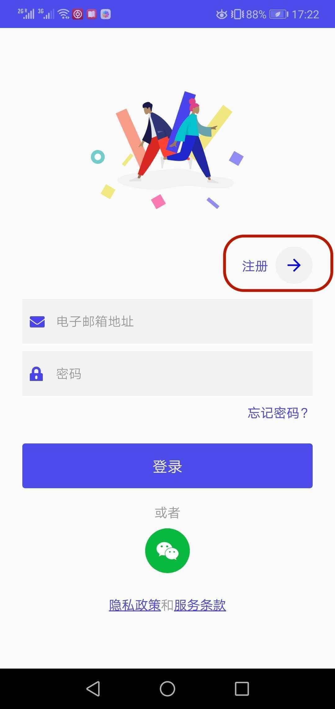
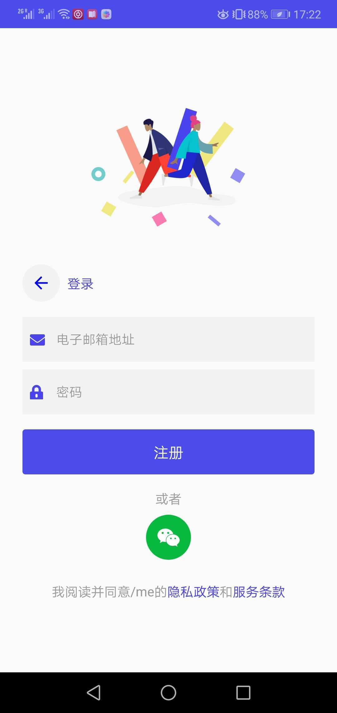

# 1. /me APP 下载、注册及登录

### 下载

/me 手机端应用支持苹果的iOS和安卓系统。

快速下载，可以直接手机扫下方二维码到下方的下载页面

或者手机端浏览器输入：[https://app.slashme.com/download](https://app.slashme.com/download)

打开下载页面并下载APP

### 注册/登录

/me app下载完毕后，首页面会出现注册/登录页面。

目前手机端我们支持邮箱和微信注册/登录。


企业微信/钉钉注册/登录会在以后支持到


第一步，点击“注册”到注册页。

第二步，输入邮箱地址/密码后点击注册，或者直接点击微信图标注册。

