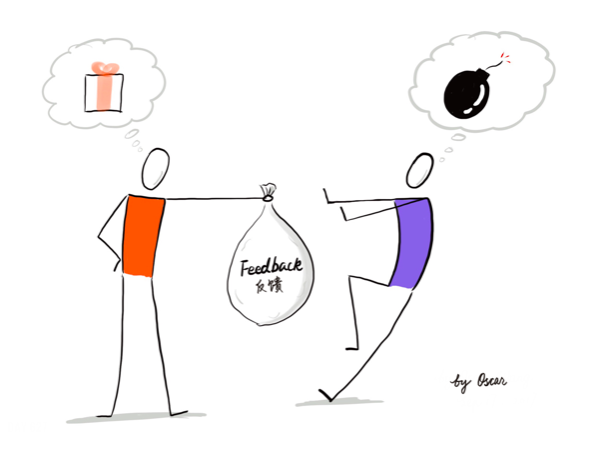
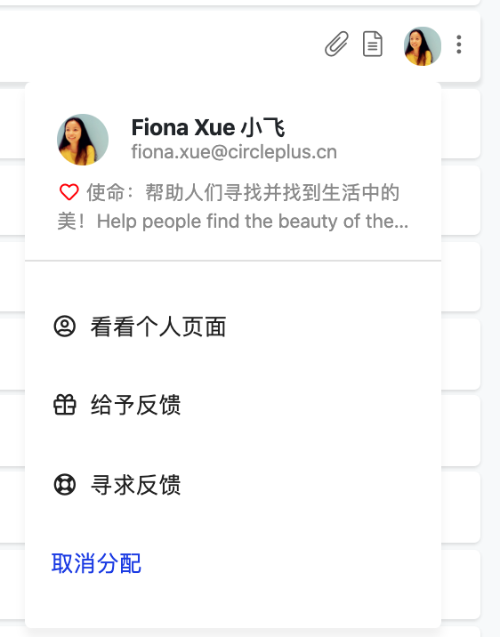
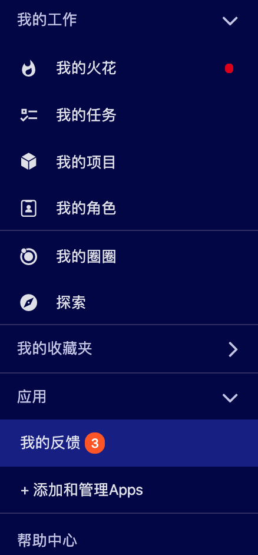
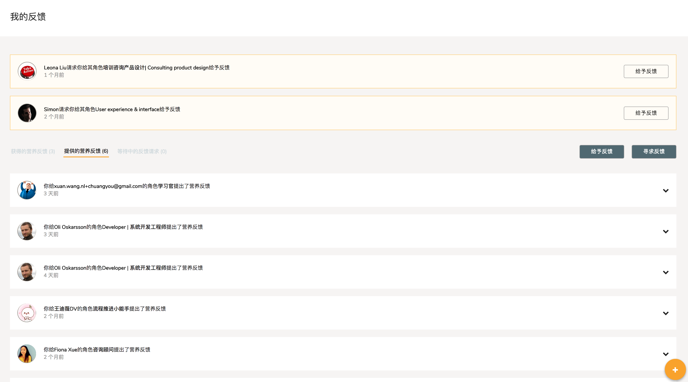
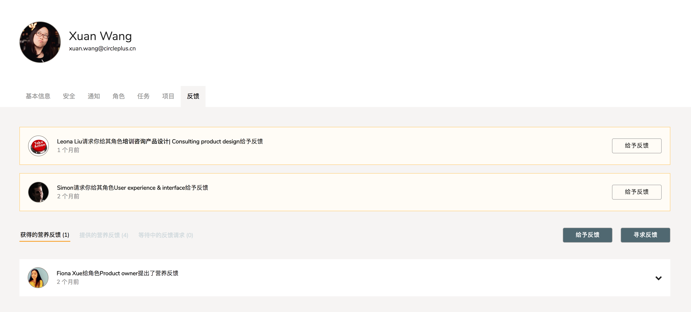
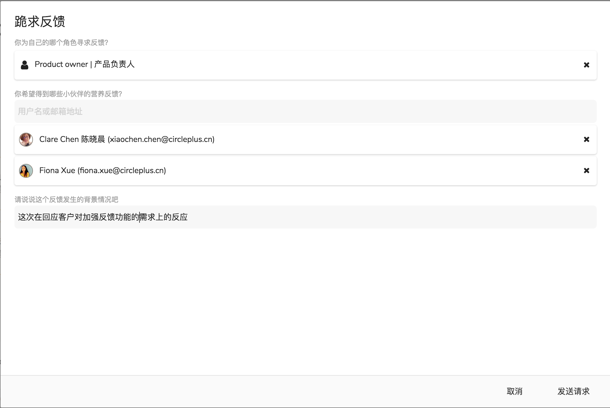
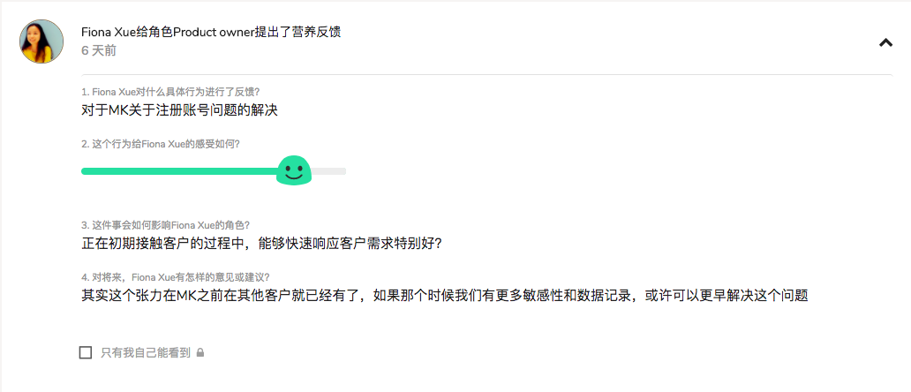

# 5.6 营养反馈

> **“**追本溯源，每个组织都是其成员思考与互动方式的产品。”
>
> **—**《第五项修炼实践篇》

当提到反馈的时候，你的脑海中会呈现出什么样的画面？那是一次高效愉快的沟通还是一次情绪化的冲突？你是如何看待反馈的？你收到的反馈到底是帮助你成长的金玉良言还是披着反馈外衣的指责和贴标签？反馈的正确打开姿势是什么？

反馈是一份珍贵的礼物。反馈可以帮助从他人的视角收集到更加丰富的信息从有效地提升自我认知。缺乏反馈的工作就像是在一场重要的旅程中缺失了地图和路标。你可能有很好的方向感，但是这不足以让你走在正确的路上。在进化型团队中，圈子成员之间能够真诚并有效地给予反馈对“身心完整（Wholeness）”有着重大的意义。

### 反馈机制的设计假设

Slashme如何能帮圈子成员真诚并有效地给予反馈呢？我想先介绍一下Slashme反馈机制背后的假设。

假设1：我们是在摸得到、看得到、感觉得到的世界中找到生命的真相。我们是透过经验了解真相，而不是从学术性的抽象理论或虚拟的情景中了解真相。

假设2: 真实的感受和情绪是从这些经验中产生的，无论我们遇到的是什么经验。而从感受、情绪、所产生的内在资料与外在可观察的资料同样真实，因此在反馈的过程中也必须认真加以考虑。

假设3: 角色的使命和意义是通过不断处理我们真实的工作而实现的。

假设4: 对工作中具体行为的洞察是为了将它投射到未来。

这是一个整体的过程，调动理性与感性，运用了整个身体的感官自主地推动。

基于以上的假设，Slashme系统的反馈功能是基于四层逻辑而设计的。它是从感知、响应、判断到决定的一个自然流动的内在过程。

第一层次：客观性层次。这个层次的问题问的是事实和外在的现实情况。

第二层次：反映性层次。这个层次的问题唤起对于外在事实立即出现的反应和内在的响应，呈现为情绪和感觉。

第三层次：诠释性层次。这个层次的问题寻找的是意义、价值、重要性及含义。

第四层次：决定性层次。这个层次的问题是要找出建设性意见。

根据这样四层逻辑，我们设计了以下四个问题。

**反馈问题1：我想对什么具体行为进行反馈？**

这个问题问的是你观察到的被反馈者的具体行为。客观具体的描述可以让反馈者与被被反馈者共同分享对一件事情的观察，有时候还能发现不同的视角与细节，避免盲人摸象的尴尬。

_举例：我的观察是小王（@产品经理）在过去三周的时间里，主动安排一对一会议讨论产品设计方面的张力。开会之前都有非常详细的准备，包括焦点问题和文本图示。这样的会议安排和准备显著地提升了我们讨论的效率和质量同时缩短了会议的时间。_  

**反馈问题2：这个行为给我的感受如何？**

这个问题问显现出以上所描述的具体行为引起的反馈者的情绪和感觉。基于过去的客户反馈，有效表达自我情绪是很多圈子成员的挑战。为了提升易用性，我们设计了滑动图标的方式。

_举例：_ 

**反馈问题3：这件事会如何影响我的角色？**

这个问题将反馈的行为与反馈者的角色相联系，让反馈者与被反馈者都能够清楚具体行为是如何影响一个角色实现其使命的。

_举例：小王通过高效会议加速张力解决的行为也积极地推动着我（@产品设计师）提升新产品设计的速度，加快新产品上线的进程。另外，这种高质量的讨论和互动让我非常享受工作的过程。_

**反馈问题4：对将来，我有怎样的意见或建议？**

这个问题要求反馈者从自身角色的角度为被反馈者提供可行的行动建议。具体清晰的行动建议更加容易被落实，对未来产生直接的积极影响。

_举例：我的建议是希望小王在会议开始之前至少24小时能够把相关的资料与问题分享给我，这样我能够有时间提前思考，进一步提升讨论的效率与质量。_

相信读到这里，你已经了解了Slashme反馈机制在设计上的整套假设与逻辑。我们由衷地希望你能够擅用这套反馈机制更好地帮助你自己和小伙伴们快速成长，更好地帮助你的圈子实现其使命。

### 开启“营养反馈“App

在一个工作空间的刚创建的时候，反馈功能默认是未启动的状态。任何一位有工作空间管理员权限的小伙伴都可以在工作空间下的设置里，“应用”一项下开启“反馈”功能。具体操作[**请看这里**](kai-qi-ying-yong.md)。

### **发动反馈的两种方式和三个路径**

两种方式：现在大家可以主动的向他人需求反馈，或者也可以直接给予别人营养反馈。

三个路径：

1. 大家可以点击其他小伙伴的头像，在弹出的小方框里选择索取或者给予反馈。

**2.** 在左边的应用栏 -&gt; “我的反馈”下可以看到所有自己给予的和寻求的反馈。同时在这里可以发出反馈请求和给予反馈。

3. 在右上角的个人头像下的“个人页面”的“反馈”项下可以看到同样的反馈信息，以及发出和寻求反馈。

### **请求反馈**

请求反馈的时候，可以同时争取几位小伙伴的反馈。特别希望大家可以尽量给足这个反馈请求的背景信息，针对哪个项目或者行为的反馈。这样会收获真正有营养的反馈哈。 

### **给予和接收反馈**

下面是给予反馈时的几个问题。请大家尽量针对某个你观察到的行为给予真诚的反馈。

### **反馈消息**

1. 反馈请求和给予的反馈可以通过几个途径看到：
   1. 在消息栏下，我们会有及时的通知
   2. 在系统左侧的“我的反馈”下，可以看到有几条待处理的反馈。


1. 反馈如果可以及时的经常的进行会对我们的成长有很大的帮助。大家可以有意识的在完成一个协作项目后，或者承担一个角色一段时候定期来主动向周围的小伙伴寻求反馈。同时，也可以在发现一些可以给别人反馈的点上及时的真诚的给到。
2. 线上反馈的好处是可以帮助整理反馈的思路和记录下过往的反馈。要想达到最好的效果，强烈建议小伙伴们在线上给予反馈后，可以线下面对面的交流一下哈。
3. 在默认的情况下，所有给予的反馈都是公开的，这样可以方便其他的小伙伴从你收获的反馈里也有所成长。当然，大家也可以选择让某个反馈只有自己可见。


