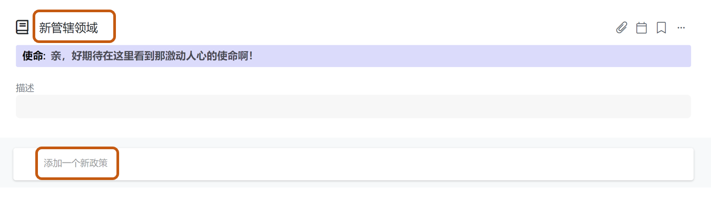

# 5.4 管辖领域

### 什么是管辖领域？

管辖领域/政策 作为/me我斜杠支持分布式自组织协同模式的关键要素，帮助团队更加开放透明，清晰敏捷的了解团队不同圈子/角色所拥有的权力，决策模式。这也是DAO组织模式的必备要素之一。

### 知识小贴士[📝](https://emojipedia.org/memo/)​

> **管辖领域：**
>
> **是一个圈子/角色独立拥有的资源。是角色或圈子能够绝对控制和管理的一些事项。角色或圈子在其所拥有的管辖领域有自主权，但在未得许可的情况下不得干预他人的管辖领域。** 
>
> 管辖领域是 CirclePlus 共创进化组织在权力分配方面的重要部分。充分体现了“分权”的理念，对角色和圈子充分授予决策和管理权力，使得组织内部“权责”前所有为的高度匹配 ； 
>
> 角色和子圈子被赋予权力的同时，也体现了组织对他们的充分信任，主人翁意识由此而成
>
> **政策：**
>
> **政策被定义为 “影响圈子或角色管辖领域的授权或限制”。因此，当圈子拥有管辖领域（财产）时，圈子可以在管理会议上制定相应政策，或允许圈子外的角色对该财产施以影响，或阻止自己圈子 内的角色以某种方式对该财产施以影响。** 
>
> 政策必须对应并归属于某一管辖领域，可为圈子所对应管辖领域之下的政策，或角色多对于管辖领域之下的政策

### 添加管辖领域和政策

第一步：进入圈子主页点击**“管辖领域/政策”** -&gt; 选择**“添加管辖领域”**

第二步：填写“新管辖领域”的名称，以及“新政策”的名称

点击”新政策“ 进入内容页面，你可以通过

A：描述框填写政策内容；

B：团队云端文档共享链接-本政策的链接复制到描述框；

C: 以附件形式添加该政策文档到本空间

举个例子：

