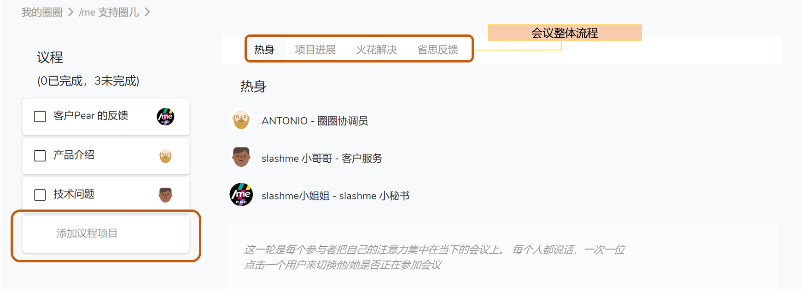

# 5.2 会议

全新的敏捷会议运行模式。没有老板，怎么开会，/me 我斜杠的会议模块应用，一起试试吧！

### 召开会议

在你要开会的圈层，点击”会议“功能，然后点击**”开始圆桌会议”。**

### **进行会议**

任何参与会议的伙伴都可以**“添加议程项目”。**按照“会议整体流程” 的指导一步步进行会议。

### 安排议程

鼠标挪至你需要挪动的“议程项目”左侧，出现紫色斜杠条纹，用鼠标点住，并挪到你希望的位置即可。

### 议程处理

点击**“火花解决”**，提出火花的伙伴描述详情，并记录在如下文本框内。

### 保存议程

会议产出当时被开放记录，任务即刻落到角色，方便查询和管理。  
点击**@客户服务角色** 也可以即刻看到这条任务。

### 会议记录

* 进入需要查询记录的圈子主页，点击“会议”即可看到已经召开的会议记录
* 点击条目，可以查询详细的信息，包括参加人员，会议产出


如果在这个列表上无法看到已经完成的会议。 可以点击整个页面右上角"漏斗（过滤器）"按钮, 不要勾选 "隐藏已完成的条目”，试试看吧


