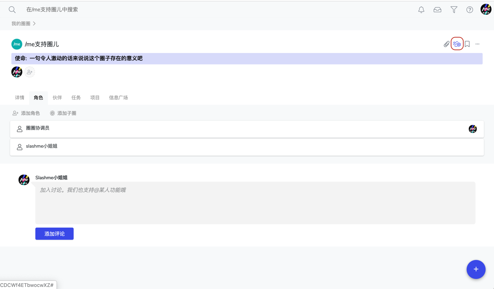
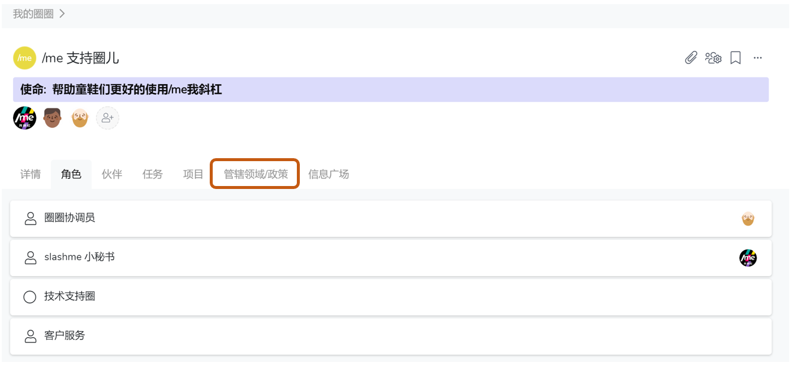

# 5.1 开启应用

/me 我斜杠 帮助你和团队更好的运行新的工作方式，我们将不断推出和**自主管理/斜杠青年/意义使命驱动/敏捷开放工作相关的**一系列应用。

在创建好一个根圈后，可以进一步开启更多的应用。

### 选择并开启应用

第一步：有两种路径可以找到应用列表：

[☝](https://emojipedia.org/white-up-pointing-index/)在一个根圈子下，左边栏选择点击 **“应用”** -&gt; 选择你的圈子所需要的应用，点击**“开启”**

[✌](https://emojipedia.org/victory-hand/)在一个根圈子下，点击右侧的根圈设置按钮，找到应用页。

第二步：你可以在根圈子内的任何圈子查看到该应用的开启


应用一旦开启，则整个根圈子内的任何圈子都将可以看到并使用该应用；

根圈子负责人和管理员有权限开启或关闭应用


